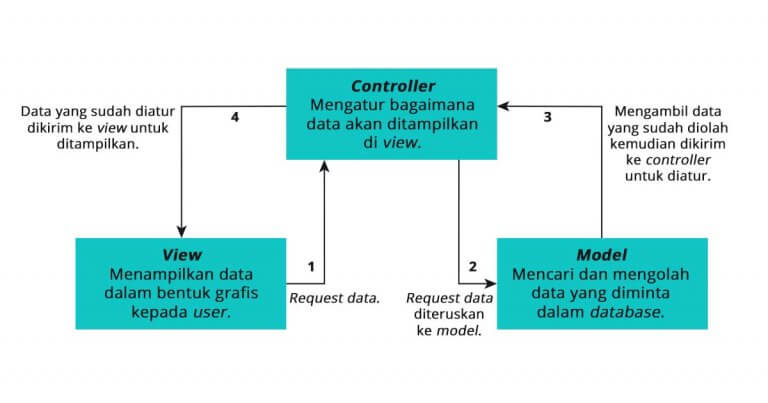

# Laporan Modul 1: Perkenalan Laravel

**Mata Kuliah:** Workshop Web Lanjut
**Nama:** Hamizan Putra Zulia
**NIM:** 2024573010013
**Kelas:** TI-2C

---

## Abstrak

Laporan pada praktikum ini berfungsi untuk mengetahui apa itu laravel, kakrakteristik utama pada laravel, jenis aplikasi laravel yang cocok, komponen-komponen utama pada laravel, penjelasan dari setiap folder dan files yang ada didalam folder project laravel, diagram MVC beserta cara kerjanya, dan untuk mengetahui kelebihan serta kekurangan yang ada pada laravel menurut saya.
Laporan praktikum ini bertujuan untuk mengumpulkan tugas dari mata kuliah Workshop Web Lanjut.

---

## 1. Pendahuluan

Seperti yang kita ketahui, Laravel adalah sebuah framework PHP open-source yang memiliki tujuan agar dapat menyederhanakan proses mengembangkan aplikasi web. Yang dibuat agar dapat mempercepat proses pengembangan web yang berbasis PHP.
Karakteristik utama laravel yaitu dukungan arsitektur MVC (Model-View-Controller) untuk struktur kode yang rapi, Eloquent ORM untuk akses data yang mudah, Blada Template Engine untuk membuat tampilan dinamis, serta Artisan Command Line Interface untuk otomatisasi tugas pengembangan.
Arsitektur MVC (Model-View-Controller) adalah pola desain yang memisahkan logka aplikasi, antarmuka pengguna (tampilan), dan kontrol. Ini membuat kode lebih terorganisir, mudah dikelola, dan efisien dalam pengembangannya. Laravel cocok untuk pengembangan aplikasi yang berjenis aplikasi web.

---

## 2. Komponen Utama Laravel

- Blade (templating)
  Blade templating adalah sistem template yang terintegrasi ke dalam framework Laravel yang dimaksudkan untuk menyederhanakan pembuatan tampilan pada aplikasi web. Memungkinkan pengembang membuat layar dengan cepat dan efisien menggunakan sintaksis yang bersih dan intuitif. Blade menawarkan berbagai fitur berguna, seperti: Misalnya, pewarisan tata letak, penanganan logika kontrol yang mudah menggunakan pernyataan seperti @if, @foreach, dan @else, dan kemampuan untuk menyertakan tampilan lain menggunakan perintah. @sertakan`. Fitur-fitur ini memungkinkan pengembang untuk mengatur kode tampilan dengan lebih baik, meningkatkan keterbacaan, dan menyederhanakan pemeliharaan kode. Selain itu, Blade juga menyediakan penggunaan langsung variabel PHP dalam tampilan menggunakan sintaks “{{ $variable }}, yang membuatnya lebih mudah untuk menggunakan data dinamis dalam tampilan. Blade secara otomatis mengelola keamanan dengan mencegah serangan skrip lintas situs (XSS) dengan memfilter nilai variabel secara otomatis sebelum memasukkannya ke dalam HTML. Hal ini memungkinkan pengembang membuat iklan yang aman tanpa mengkhawatirkan potensi kerentanan keamanan.

- Eloquent (ORM)
  Laravel Eloquent adalah ORM (Object-Relational Mapping) yang kuat dalam kerangka kerja PHP Laravel. Ini digunakan untuk berinteraksi dengan basis data menggunakan objek dan model alih-alih SQL murni. Eloquent membantu memudahkan dalam menjalankan operasi CRUD (Create, Read, Update, Delete) pada data dalam basis data.

- Routing
  Routing dalam konteks pengembangan web adalah proses menentukan bagaimana aplikasi merespons permintaan dari pengguna berdasarkan URL yang diakses. Dengan routing, pengembang dapat mendefinisikan rute untuk URL tertentu yang mengarah ke fungsi atau metode tertentu dalam aplikasi yang memungkinkan pembuatan aplikasi lebih terstruktud dan mudah dikelola.
  Route pada Laravel digunakan untuk menentukan bagaimana aplikasi web merespons permintaan HTTP dari pengguna. Dalam Laravel, setiap rute dihubungkan dengan sebuah URL dan metode HTTP seperti GET, POST, PUT, atau DELETE yang akan direspons oleh aplikasi.
  Routing di Laravel memiliki beberapa fungsi yang mendukung pengembangan aplikasi web yang efisien dan terstruktur.

- Controllers
  Controller adalah salah satu komponen inti dari MVC yang berfungsi sebagai penghubung antara request user (View) ke model ang nantinya akan dikembalikan lagi ke View dalam bentuk response. Controller ini akan banyak berisi logika -logika dalam menyusun suatu fungsi tertentu. Contohnya adalah aktivitas CRUD (Create, Read, Update, Delete) yang prosesnya berjalan di dalam Controller.

- Migrations & Seeders
  Migrasi adalah jenis kontrol versi untuk database. Migrasi memungkinkan tim untuk dapat memodifikasi skema basis data dan tetap mengetahui status skema terkini. Migrasi biasanya dipasangkan dengan Schema Builder untuk mengelola skema aplikasi dengan mudah.

- Artisan CLI
  Laravel Artisan merupakan perintah command line yang disediakan oleh Laravel untuk melakukan berbagai aktivitas pada pengembangan web. Artisan merupakan CLI utilitu pada Laravel seperti yang dimiliki framework web development lain. Banyak programmer yang seringkali malas untuk menggunakan perintah command line dalam membuat sebuah program. Namun demikian pada pengembangan web dengan menggunakan Laravel, penggunaan Artisan sangat membantu dalam pengerjaan berbagai hal yang apabila dikerjakan secara manual akan menghabiskan banyak sekali waktu serta memperbesarkan kesalahan dalam pengerjaannya.
  Artisan sendiri dikembangkan dengan menggunakan PHP, sehingga dalam menjalankan perintah artisan akan dipergunakan runtime engine dari PHP. Beberapa hal yang dapat dibuat dengan Artisan antara lain: model, controller, maupun database migration.

- Testing (PHPUnit)
  Testing adalah komponen kritis dalam pengembangan aplikasi Laravel utuk memastikan fungsionalitas beralans esuai ekspektasi. Laravel secara default menyediakan PHPUnit sebagai framework testing utama. Meskipun Pest semakin populer, PHPUnit tetap menjadi pilihan utama bagi banyak debeloper karena kematangan dan integrasinya yang kuat dengan ekosistem PHP. 
  PHPUnit adalah framework unit testing paling populer untuk bahasa pemrograman PHP yang dikembangkan oleh Sebastian Bergmann, PHPUnit menjadi standar de facto untuk pengujian perangkat lunak di ekosistem PHP, termasuk Laravel.
---

## 3. Berikan penjelasan untuk setiap folder dan files yang ada didalam sebuah project laravel.
#### Folder
 1. App
  Folder app berisi kode-kode inti dari aplikasi seperti Model, Controller, Commands, Listener, Events, dll. Poinnya, hampir semua class dari aplikasi berada di folder ini.

 2. Bootstrap
  Folder bootstrap berisi file app.php yang dimana akan dipakai oleh Laravel untuk boot setiap kali dijalankan.

 3. Config
  Folder config seperti namanya, berisi semua file konfigurasi aplikasi anda.

 4. Database
  Folder database berisi database migrations, model factories, dan seeds. Folder ini akan bertanggung jawab dengan pembuatan dan pengisian tabel-tabel database.

 5. Public
  Folder public memiliki file index.php yaitu entry point dari semua resuests yang masuk/diterima ke aplikasi. Folder ini juga tempat menampung gambar, JavaScript, dan CSS.

 6. Resources
  Flder resources berisi semua route yang disediakan aplikasi. Sebagai default, beberapa file routing akan tersedia seperti: web.php, api.php, console.php, dan channels.php. Folder ini adalah tempat dimana kita memberikan koleksi definisi route aplikasi.

 7. Storage
  Folder storage adalah tempat dimana cache logs, dan file sistem yang ter-compile hidup.

 8. Tests
  Folder tests adalah tempat dimana unit dan integration tests tinggal.

 9. Vendor
  Folder vendor adalah tempat dimana folder-folder dependencies third-party yang telah di-install oleh composer berada.

#### Files
 1. .editorconfig
  Berguna untuk memberi IDE/text editor instruksi tentang standa coding Laravel seperti whitespace, besar indentasi, dll.

 2. .env dan .env.example
  Tempat dimana variabel environment aplikasi ditempatkan (variabel yang diekspektasikan akan berbeda di setiap sistem) seperti nama database, usernam database, password database.

 3. .gitignore dan .gitattributes
  File untuk konfigurasi git.

 4. artisan
  Memungkinkan nada untuk menjalankan perintah artisan dari command line.

 5. composer.json dan composer.lock
  File konfigurasi untuk composer. File ini adalah informasi dasar tentang project dan juga mendefinisikan dependencies yang digunakan.

 6. package.json
  Mirip-mirip dengan composer.json tapi untuk aset-aset dan dependencies front-end. 

 7. phpunit.xml
  Sebuah file konfigurasi untuk PHPUnit, tools yang digunakan Laravel untuk testing.

 8. readme.md
  Sebuah markdown file yang memberikan pengenalan dasar tentang Laravel.

 9. server.php
  Server cadangan yang mencoba untuk tetap menjalankan aplikasi Laravel kepada server yang kurang mampu.

 10. webpack.mix.js
  Konfigurasi file untuk Mix (opsional). File ini adalah untuk membangun arahan system soal bagaimana meng-compile.

---

## 4. Diagram MVC dan Cara Kerjanya
##### Pengertian MVC
 Model View Controller atau yang dapat disingkat MVC adalah sebuah pola arsitektur dalam membuat sebuah aplikasi dengan cara memisahkan kode menjadi tiga bagian yang terdiri dari:
 - Model
  Bagian yang bertugas untuk menyiapkan, mengatur, memanipulasi, dan mengorganisasikan data yang ada di database.
 - View
  Bagian yang bertugas untuk menampilkan informasi dalam bentuk Graphical User Interface (GUI).
 - Controller
  Bagian yang bertugas untuk menghubungkan serta mengatur model dan view agar dapat saling terhubung.

##### Alur Model View Controller
 Setelah kamu mengetahui penjelasan dan komponen dari MVC, sekarang kita akan membahas alur proses dari MVC. Ini prosesnya:
 1. Proses pertama adalah view akan meminta data untuk meminta data untuk ditampilkan dalam bentuk grafis kepada pengguna.
 2. Permintaan tersebut diterima oleh controller dan diteruskan ke model untuk diproses.
 3. Model akan mencari dan mengolah data yang diminta di dalam database.
 4. Setelah data ditemukan dan diolah, model akan mengirimkan data tersebut kepada controller untuk ditampilkan di view.
 5. Controller akan mengambil data hasil pengolahan model dan mengaturnya di bagian view untuk ditampilkan kepada pengguna.

##### Kesimpulan
Jadi, MVC adalah metode dalam membuat aplikasi dengan cara memisahkan kode menjadi tiga bagian, yaitu Mode, View, dan Controller. Karena memiliki tiga bagian yang saling berkaitan satu sama lain model view controller ini jadi memiliki banyak keuntungan untuk pengembangan dan pemeliharaan aplikasi.

---

## 5. Kelebihan & Kekurangan
Kelebihan Laravel menurut saya yang baru-baru menggunakan Laravel dan belum terlalu berpengalaman dalam menggunakannya, atau bisa dibilang ini first impression saya adalah Laravel sangat mudah digunakan oleh pemula dengan syntax yang sangat mudah dipahami oleh pemula seperti saya. Laravel sangat memudahkan penggunanya dalam melakukan proses routing nya.

Ada bebrapa kendala yang menurut saya menyulitkan dalam menggunakan laravel yaitu command line nya yang cukup banyak pilihan yang membuat pengguna baru bingung dalam menggunakannya. Dan lagi, (ini menurut saya pribadi yang merasakannya) ketika jaringan tidak lancar maka instalasi folder project Laravel akan timeout dan seperti mengharuskan user menggunakannya dengan jaringan yang stabil untuk melakukan instalasi folder project nya.

---

## 6. Referensi
- Blade Templating - https://course-net.com/blog/penggunaan-blade-templating-di-laravel/
- Laravel Eloquent ORM - https://course-net.com/blog/apa-itu-laravel-eloquent/
- Laravel Routing - https://course-net.com/blog/laravel-route/
- Laravel Controller - https://informatika.ciputra.ac.id/2019/10/laravel-controller/
- Migrations & Seeding - https://laravel.com/docs/4.2/migrations#introduction
- Laravel Artisan CLI - https://informatika.ciputra.ac.id/2019/10/laravel-artisan/
- Laravel Testing (PHPUnit) - https://qadrlabs.com/post/testing-laravel-dengan-phpunit
- Diagram MVC dan cara kerjanya - https://www.dicoding.com/blog/apa-itu-mvc-pahami-konsepnya/
- Struktur Project Laravel (Folder-folder dan files) - https://www.barajacoding.or.id/mengenal-struktur-folder-dan-file-pada-laravel/
---
