# Laporan Modul 2: Laravel Fundamental
**Mata Kuliah:** Workshop Web Lanjut   
**Nama:** Hamizan Putra Zulia
**NIM:** 2024573010013
**Kelas:** TI-2C

---

## Abstrak 
Laporan praktikum ini berisi tentang apa saja peran dari MVC (Model, View, Controller) yang memiliki fungsinya masing masing. Seperti dalam praktikum ini yang membuat sebuah calculator dan membuat halaman welcome menggunakan komponen View untuk menampilkan HTML yang ada di file blade.php, Model yang berperan untuk menerima data. Namun pada praktikum ini, model tidak berpengaruh karena tidak menggunakan database dalam programnya. Dan terakhir Controller, yang mengatur apa yang akan dilakukan oleh program selnjutnya, contoh disni ada pada penambahan, pengurangan, perkalian, dan pembagian yang secara keseluruhan dilakukan oleh Controller.

---

## 1. Dasar Teori
- Apa itu MVC (Model, View, Controller).
    - Model:
    Model berperan sebagai penerima data definisi dari produk seperti nama, dan barang-barang lainnya dan logika bisnis untuk memproses pesanan atau memprebarui suatu informasi dalam suatu produk. Model adalah yang berhubungan dengan database, termasuk yang mengatur logika dari database.

    - View:
    View berguna untuk menampilkan hasil dari HTML Blade sebagai template engine.

    - Controller:
    Controller yang berfungsi untuk menangani logika permintaan. Yang dapat menangani CRUD (Create, Read, Update, Delete) data dari database menggunakan Eloquent ORM.

- Konsep Routing di Laravel.
    Routing mendefinisikan bagaimana aplikasi di web Laravel meresepons premintaan yang masuk.

- Fungsi Middleware.
    Middleware berfungsi untuk menyediakan mekanisme untuk memfilter permintaan HTTP yang masuk ke dalam aplikasi. Middleware berguna sebagai lapisan yang berada di antara siklus request dan response. Contohnya waktu seorang user sudah pernah login ke sebuah web yg memiliki keharusan untuk login, kemudian user tersebut close dan masuk kembali ke web tersebut maka disitulah pekerjaan middleware yang membuat user tidak harus login kembali, namun otomatis login ke web tersebut.

- Bagaimana cara Laravel menangani Request dan Response.
    Laravel membuat sebuah kode untuk dapat mengakses data request menggunakan objek request yang dimiliki, seperti:
    use Illuminate\Http\Request;
    use Illuminate\Support\Facades\Route;

    Route::get('/user', function (Request $request) {
        $name = $request->input('name');
        return "Hello, " . $name;
    });

    Sedangkan dalam menganani response laravel mengembalikan string, view, JSON, dan juga file download dengan kode:
    return response('Hello World', 200)
        ->header('Content-Type', 'text/plain');
    Laravel juga mendukung response dalam bentuk JSON, redirect, file download dan juga file lainnya.

- Peran Controller dan View.
    Controller digunakan untuk mengatur logika dari aplikasinya. File controller berada di dalam app/Http/Controllers. Controller juga dapat dibuat dengam menggunakan perintah yang ada seperti dari artisan:
    php artisan make:controller **<nama_controller>**
    View pada laravel berperan sebagai yang menampilkan hasil HTML pada Blade templateing di browser.

- Fungsi Blade Templating Engine.
    Blade templating adalah sistem template bawaan dari Laravel yang memungkinkan untuk membuat tampilan web dengan cara yang lebih rapi dan terstruktur.
    Dengan menggunakan Blade, bisa membuat berbagai bagian dari halaman web sepeti header, dan footer yang bisa digunakan kembali di banyak halaman tanpa perlu menulis ulang kembali kode ang diperlukan, yang membuat proses pengembangan web menjadi lebih cepat dan mudah.
    Blade juga menyediakan berbagai fitur sederhana untuk menggabungkan logika PHP dengan HTML, seperti menampilkan data dari database atau memrika kondisi tertentu dengan menggunakan sintaks yang mudah untukdibaca dan dipahami.

---

## 2. Langkah-Langkah Praktikum
Tuliskan langkah-langkah yang sudah dilakukan, sertakan potongan kode dan screenshot hasil.

#### 2.1 Praktikum 1 – Route, Controller, dan Blade View

- Tambahkan route pada routes/web.php.
    1. Masuk ke folder helo-laravel/routes dan klik file web.php

    2. Tambahkan potongan kode ini dipaling bawah:
        Route::get('/welcome', [WelcomeController::class, 'show']);

- Buat controller WelcomeController.
    1. buka git bash pada folder helo-laravel

    2. Kemudian, ketik:
        php artisan make:controller WelcomeController

    3. Maka akan tampil file ini: 
    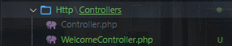

- Buat view mywelcome.blade.php.
    1. Masuk ke folder view

    2. Klik add new file

    3. Berikan nama "mywelcome.blade.php"

- Jalankan aplikasi dan tunjukkan hasil di browser.
    1. Masuk ke git bash/terminal 

    2. Ketik "php artisan serve"

    3. Lalu, klik link yang muncul, dan akan tampil pada web defaultnya

Screenshot Hasil: 
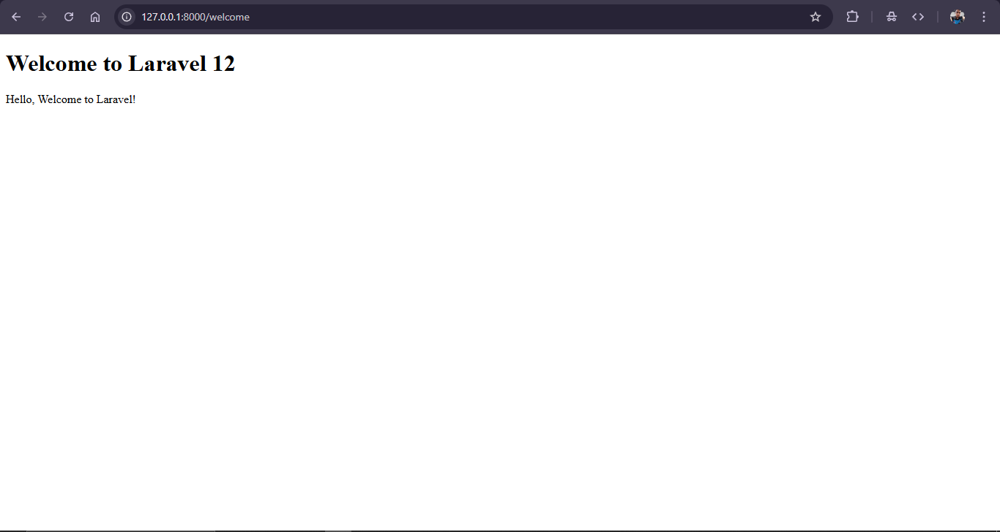

#### 2.2 Praktikum 2 – Membuat Aplikasi Sederhana "Calculator"

- Tambahkan route untuk kalkulator.
    1. Masuk ke folder calculator/routes dan klik file web.php
    
    2. Tambahkan potongan kode ini dipaling bawah:
        Route::get('/calculator', [CalculatorController::class, 'index']);
        Route::post('/calculator', [CalculatorController::class, 'calculate'])->name('calculator.calculate');
    Contoh gambar: 
    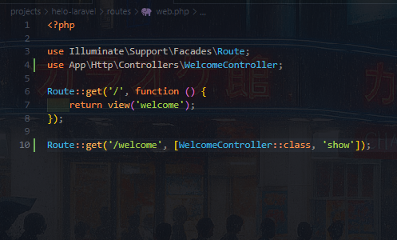

- Buat controller CalculatorController.
    1. Masuk ke terminal/git Bash lalu ketik
        php artisan make:controller  
    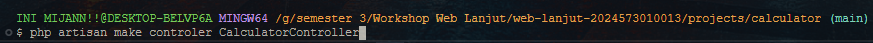

    2. Lalu akan muncul file baru dengan nama "CalculatorController" 
    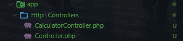

- Tambahkan view calculator.blade.php.
    1. Masuk ke folder resources/views/ 

    2. Tambahkan file biasa dengan nama calculator.blade.php
    Contoh: 
    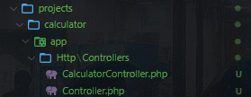

- Jalankan aplikasi dan coba dengan beberapa input berbeda.

    1. Pertambahan: 
    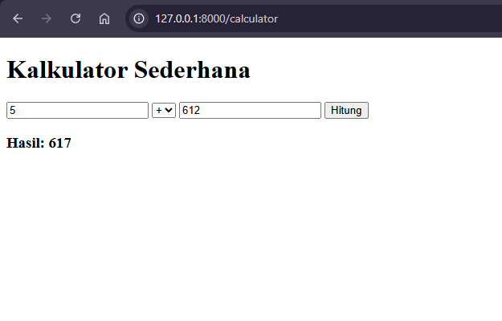

    2. Pengurangan 
    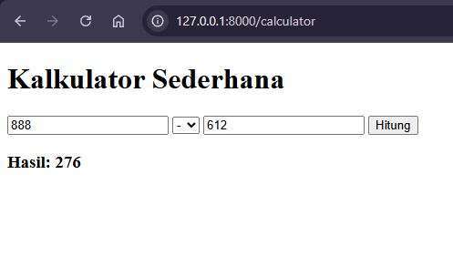

    3. Perkalian 
    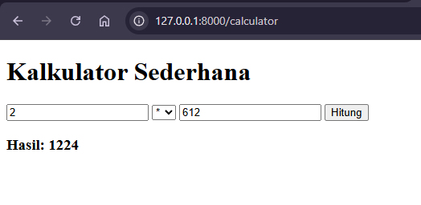

    4. Pembagian 
    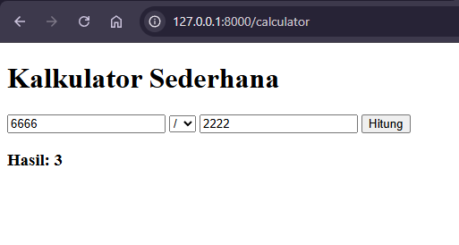

Screenshot Hasil: 
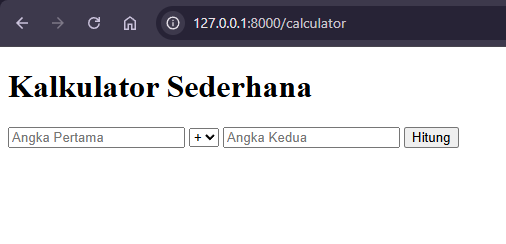

---

## 3. Hasil dan Pembahasan
- Aplikasi web menggunakan Laravel berjalan dengan sangat lancar, semua yang ingin ditampilkan akan tampil sesuai dengan keinginan dan yang ingin dibuat jika mengikuti praktikum dengan teliti tanpa ada typo dikitpun.

- Jika melakukan pembagian berapapun dengan nilai 0 maka akan tampil Internal Server Error dari Laravel berdasarkan program yang dibuat di dalam file Controller "CalculatorController". Jika dari contoh praktikum ini akan muncul tampilan "Internal Server Error - Division by zero".

- Validasi input di Laravel bekerja dengan menerima inputan dari file blade.php lalu akan dikirimkan tergantung dari method form nya, kemudian akan mengirimkannya ke routes lalu Controller dan akan diproses oleh file Controller.

- Komponen route dari program pada praktikum ini berperan sebagai jalur untuk menghubungkan blade.php ke controller nya. Sedangkan controller di praktikum ini berperan sebagai logika untuk menambah, mengurangi, mengalikan, dan membagi nilai dari angka pertama dan angka kedua dari program. Dan terakhir komponen view, komponen view ini berperan untuk menampilkan file HTML yang ada ke web dari file blade templating.

---

## 4. Kesimpulan

Jadi, pada praktikum laravel fundamental ini dalam memanfaatkan MVC (Model, View, Controller) di Laravel dapat mempermudah dalam proses pengembangan website. Pada akhirnya, hasil dari Laravel bergantung pada logika pembuatannya. 

---

## 5. Referensi
- Laravel Fundamentals - https://hackmd.io/@mohdrzu/B1zwKEK5xe#Praktikum-1---Route-Controller-dan-Blade-View
- Blade Templating - https://www.rumahweb.com/journal/belajar-laravel-bagian-4/#Apa_itu_Blade_Templating

---