# Laporan Modul 3: Laravel Controller
**Mata Kuliah:** Workshop Web Lanjut   
**Nama:** Hamizan Putra Zulia
**NIM:** 2024573010013
**Kelas:** TI-2C

---

## Abstrak 
Laporan praktikum ini membahas tentang bagaimana cara kerja dan penerapan Controller dalam framework Laravel 12. Controller berperan penting dalam konsep arsitektur MVC (Model-View-Controller) karena menjadi penghubung antara view (tampilan) dan model (data).
Pada praktikum ini dilakukan tiga percobaan utama yaitu: membuat controller dasar untuk menangani request dan response, membuat group route dengan controller, serta mengelompokkan prefix dan namespace pada route. Tujuan dari praktikum ini adalah agar saya dapat memahami bagaimana controller mengatur alur logika, memanggil view, dan berinteraksi dengan route di Laravel.
Dengan memahami controller, diharapkan proses pengembangan aplikasi menjadi lebih terstruktur, rapi, dan mudah di maintain.

---

## 1. Dasar Teori
- Apa itu Controller? 
Controller adalah salah satu komponen inti dari MVC yang berfungsi sebagai penghubung antara request user (View) ke model yang nantinya akan di kembalikan lagi ke View dalam bentuk response. Controller ini akan banyak berisi logika – logika dalam menyusun suatu fungsi tertentu. Contohnya adalah aktivitas CRUD (Create, Read, Update, Delete) yang prosesnya berjalan di dalam Controller. 

- Jenis-jenis Controller
    1. Basic Controllers
    2. Resource Controllers
    3. Invokable Controllers

- Routing dan Controller pada Laravel 
Routing adalah proses transmisi atau pengiriman data dari satu node ke node lainnya dalam suatu jaringan komputer atau sistem komunikasi. Ini adalah bagian penting dari bagaimana informasi ditransmisikan melalui jaringan yang terdiri dari berbagai perangkat seperti router, switch, dan gateway. Tujuan utama dari routing adalah untuk menentukan rute atau rute terbaik agar paket data mencapai tujuan akhirnya secara efisien dan andal.

    Dalam routing, setiap node dalam jaringan memiliki tabel routing yang berisi informasi tentang cara mencapai tujuan tertentu. Tabel ini diperbarui secara dinamis oleh protokol perutean, yang dapat berupa protokol statis atau dinamis, seperti RIP (Routing Information Protocol), OSPF (Open Shortest Path First) atau BGP (Border Gateway Protocol). Proses perutean melibatkan keputusan tentang rute mana yang akan diambil paket data berdasarkan informasi dalam tabel perutean.

    Keputusan ini dapat dipengaruhi oleh beberapa faktor, antara lain jarak, penggunaan jaringan, dan kondisi terkini dari setiap rute yang tersedia. Perutean memainkan peran penting dalam menjaga koneksi yang andal dan efisien dalam jaringan kompleks dengan banyak perangkat yang saling terhubung. Ini juga merupakan bagian penting dari infrastruktur Internet global, yang memungkinkan komunikasi dan pertukaran data antara perangkat dan pengguna di seluruh dunia.

    Controller adalah “Pengendali” yaitu konsep yang muncul dalam berbagai konteks, termasuk teknologi, sistem, dan manajemen. Secara umum, “pengendali” mengacu pada entitas yang memiliki kekuasaan atau kendali atas suatu proses atau sistem. Dalam konteks teknologi dan sistem komputer, “pengendali” dapat merujuk pada perangkat keras atau perangkat lunak yang bertanggung jawab untuk mengatur atau mengelola fungsi-fungsi tertentu dari suatu sistem. Contohnya termasuk pengontrol hard drive, yang melakukan operasi baca/tulis untuk data pada media penyimpanan, atau pengontrol jaringan, yang menangani komunikasi data melalui jaringan.

---

## 2. Langkah-Langkah Praktikum

### 2.1 Praktikum 1 - Menangani Request dan Response View di Laravel 12

- Langkah-langkah:
    1. Buat dan Buka Proyek Laravel, dengan mengetik: 
    
     
    Lalu masuk ke dalam folder projek nya 

    2. Buat sebuah Controller, dengan mengetik:  
    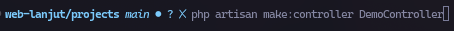
     
    Dan tambahkan kode-kode ini di DemoController:
     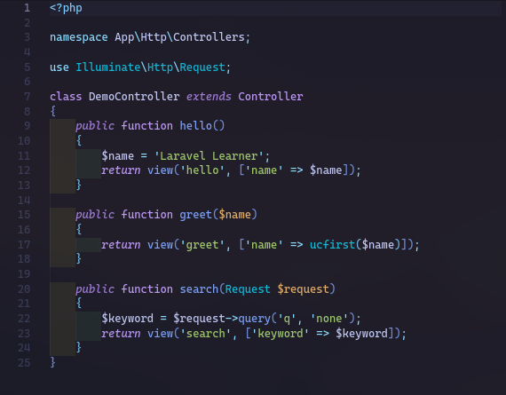

    3. Definisikan Route di routes/web.php:
     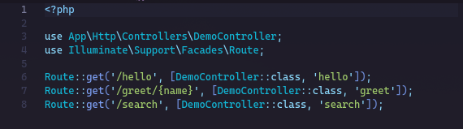

    4. Buat tiga file view web sederhana, contoh:
        - Di hello.blade.php
         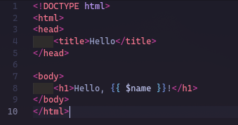

        - Di greet.blade.php
         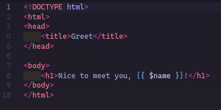

        - Di search.blade.php
         

    5. Sudah selesai dan sudah dapat dijalankan menggunakan "php artisan serve"

### 2.2 Praktikum 2 - Menggunakan Group Route
- Langkah-langkah:
    1. Buat dan buka proyek Laravel, dengan mengetik: 
    
     
    Lalu masuk ke dalam folder projek nya 

    2. Buat controller nya, dengan mengetik: 
    

    3. Masuk ke PageController lalu ubah sepserti ini: 
    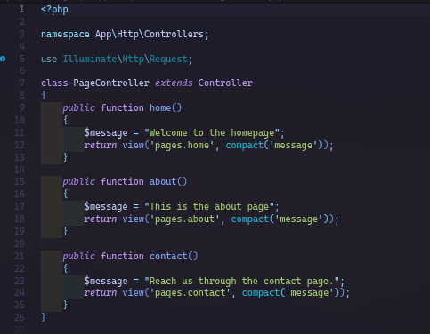

    4. Masuk ke file routes/web.php untuk menambahkan route 
    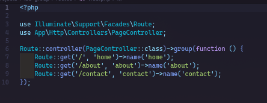

    5. Di resource/views/ tambahkan tiga file dan isi seperti dibawah ini: 
        - home.blade.php 
        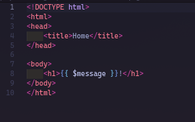 

        - about.blade.php 
        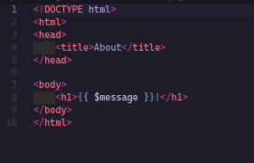 

        - contact.blade.php 
        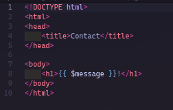 

    6. Sudah selesai dan sudah dapat dijalankan menggunakan "php artisan serve"

### 2.3 Praktikum 3 - Pengelompokan Prefix dengan Namespace Rute di Laravel 12
- Langkah-langkah
    1. Buat dan buka projek Laravel, dengan mengetik: 
    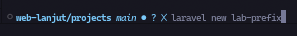

    2. Buat controller dengan namespace menggunakan ketikan ini di git bash/terminal: 
    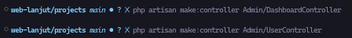

    3. Mendefinisikan kelompok route dengan prefix dan namespace controller di routes/web.php 
    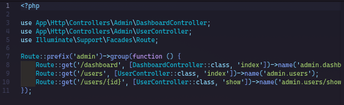

    4. Menambahkan aksi ke Controller
        - ke Admin/DashboardController
        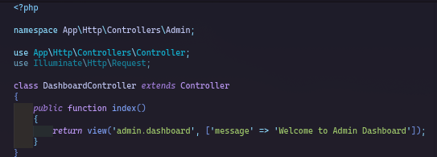

        - ke Admin/UserController
        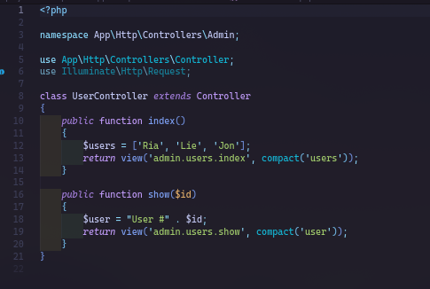

    5. Buat View sederhana 
    Tambahkan file-file dan folder yg dibutuhkan, seperti:  
        1. dashboard.blade.php
        2. users/index.blade.php
        3. users/show.blade.php

            - Tambahkan kode berikut di dashboard.blade.php 
            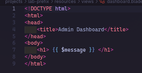

            - Tambahkan kode berikut di users/index.blade.php 
            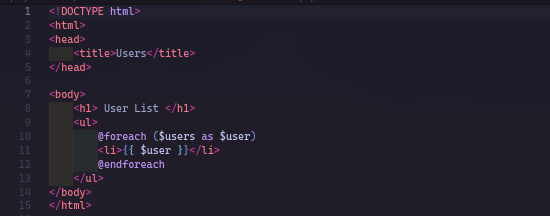

            - Tambahkan kode berikut di users/show.blade.php 
            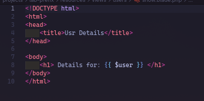
---

## 3. Hasil dan Pembahasan
Dari ketiga praktikum yang dilakukan, saya jadi lebih memahami bagaimana Laravel mengatur logika aplikasi menggunakan controller.

Pada Praktikum 1, saya membuat DemoController untuk menangani request sederhana dan menampilkan view seperti hello.blade.php, greet.blade.php, dan search.blade.php. Dari sini saya belajar bahwa controller bertugas menerima request dari route dan mengarahkan hasilnya ke view yang sesuai. Intinya, controller adalah jembatan antara user dan tampilan web.

Di Praktikum 2, saya mempelajari cara membuat group route. Fitur ini berguna banget buat ngatur route yang banyak biar lebih rapi dan mudah dibaca. Dengan menggunakan Route::controller() dan Route::group(), saya bisa mengelompokkan beberapa route yang menggunakan controller yang sama, seperti PageController untuk halaman home, about, dan contact. Jadi kodenya lebih efisien dan tidak berulang-ulang.

Lalu di Praktikum 3, saya belajar menggunakan prefix dan namespace pada route. Di bagian ini, saya membuat controller yang dipisahkan berdasarkan folder, misalnya di App\Http\Controllers\Admin. Penggunaan prefix dan namespace ini membuat struktur project lebih terorganisir, apalagi kalau nanti aplikasi sudah besar dan punya banyak bagian seperti admin, user, dan lainnya. Misalnya, route admin/dashboard dan admin/users bisa langsung diarahkan ke controller berbeda dengan struktur folder yang teratur.

Secara keseluruhan, saya jadi lebih paham peran besar controller di Laravel. Semua logika aplikasi bisa ditaruh di controller supaya kode lebih bersih, gak berantakan di file route, dan lebih mudah dikelola kalau aplikasi terus berkembang.

---

## 4. Kesimpulan
Dari praktikum ini, saya bisa menyimpulkan bahwa controller adalah bagian penting dalam Laravel karena menjadi pengatur alur data dari route menuju view. Dengan controller, kode jadi lebih terstruktur dan sesuai dengan konsep MVC.
Saya juga belajar cara menggunakan group route untuk merapikan banyak rute, serta bagaimana mengelompokkan prefix dan namespace agar controller bisa diatur sesuai fungsinya masing-masing.
Secara pribadi, saya merasa konsep controller ini bikin pengembangan web lebih mudah dan fleksibel, terutama saat aplikasi mulai besar. Praktikum ini bikin saya makin paham gimana cara Laravel ngatur arsitektur aplikasinya dengan rapi dan efisien.

---

## 5. Referensi
- Apa itu Controller? - https://informatika.ciputra.ac.id/2019/10/laravel-controller/
- Routing Dan Controller Pada Laravel - https://course-net.com/blog/routing-dan-controller-pada-laravel/

---