# Laporan Modul 4: Laravel Blade Template Engine
**Mata Kuliah:** Workshop Web Lanjut   
**Nama:** Hamizan Putra Zulia
**NIM:** 2024573010013
**Kelas:** TI-2C

---

## Abstrak 
Laporan praktikum ini membahas tentang Blade Template Engine, yaitu sistem templating bawaan dari framework Laravel yang berfungsi untuk memisahkan tampilan (view) dengan logika program. Blade memungkinkan pengembang untuk menulis kode HTML dan PHP secara lebih efisien, bersih, serta mudah dikelola melalui fitur seperti layouts, partials, dan components.

Dalam praktikum ini, dilakukan beberapa percobaan yang meliputi: meneruskan data dari controller ke view, menggunakan struktur kontrol Blade, membuat layout dengan Bootstrap, hingga menggunakan partial views dan components. Tujuannya adalah agar saya dapat memahami bagaimana Blade membantu dalam membuat tampilan web yang dinamis, reusable, dan konsisten di seluruh halaman aplikasi Laravel.

Dengan memahami Blade Template Engine, pengembangan antarmuka web menjadi lebih cepat, terorganisir, serta mempermudah kerja tim dalam membangun aplikasi berskala besar.

---

## 1. Dasar Teori
- Apa itu Blade Templating? 
    Blade templating adalah sistem template bawaan dari Laravel yang memungkinkan Anda untuk membuat tampilan web dengan cara yang lebih rapi dan terstruktur.

    Dengan Blade, Anda bisa membuat bagian-bagian dari halaman web, seperti header atau footer, yang bisa digunakan kembali di banyak halaman tanpa perlu menulis ulang kode. Tentunya, hal ini membuat proses pengembangan web lebih cepat dan mudah.

    Blade juga menyediakan fitur sederhana untuk menggabungkan logika PHP dengan HTML, seperti menampilkan data dari database atau memeriksa kondisi tertentu, menggunakan sintaks yang mudah dibaca dan dipahami.

- Laravel templating memiliki fitur utama, yaitu:
    1. View blade
    2. Sintaks dan direktif blade nya sendiri
    3. Layouts dan Sections
    4. Blade Components
    5. Blade Includes
    6. Perulangan dan Kondisional Blade
    7. Menampilkan Error Validasi

---

## 2. Langkah-Langkah Praktikum

### 2.1 Praktikum 1 - Meneruskan Data dari Controller ke Blade View
- Langkah-langkah: 
    1. Buat dan masuk ke projek laravel, dengan mengetik: 
    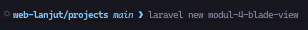
    Lalu masuk ke dalam folder projek nya 

    2. Buat controller DasarBladeController, dengan mengetik: 
    

    3. Definisikan route di routes/web.php, dengan isi seperti: 
    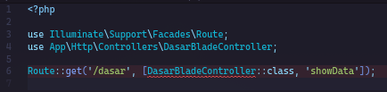

    4. Buat Metode untuk menghandle data pada Controller, seperti: 
    

    5. Buat file blade view baru di resources/views/dasar.blade.php, seperti: 
    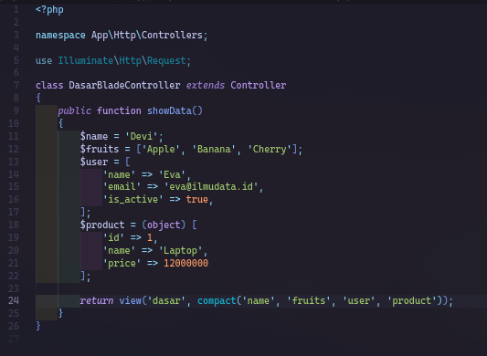

    6. Sudah selesai dan sudah dapat dijalankan menggunakan "php artisan serve"

### 2.2 Praktikum 2 - Menggunakan Struktur Kontrol Blade
- Langkah-langkah: 
    1. Buat Controller baru masih di dalam file projek yang sama, seperti: 
    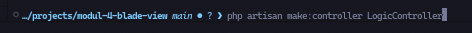

    2. Tambahkan Route baru di routes/web.php:
    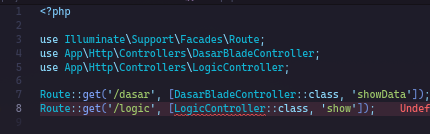

    3. Tambahkan logika Controller di app/Http/Controllers/LogicController.php  
    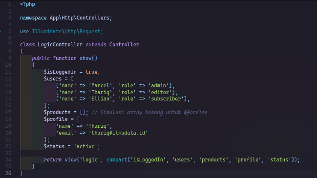

    4. Buat blade view di resources/views/logic.blade.php dengan kode berikut: 
    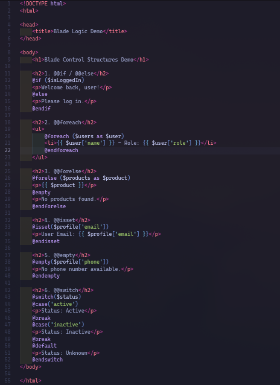

    6. Sudah selesai dan sudah dapat dijalankan menggunakan "php artisan serve"

### 2.3 Praktikum 3 - Layout dan Personalisasi di Laravel 12 dengan Bootstrap
- Langkah-langkah:
    1. Buat Controller baru masih di dalam file projek yang sama, seperti: 
    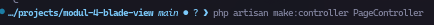

    2. Menambahkan route baru di routes/web.php: 
    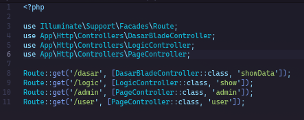

    3. Menambahkan kode logic di Controller PageController: 
    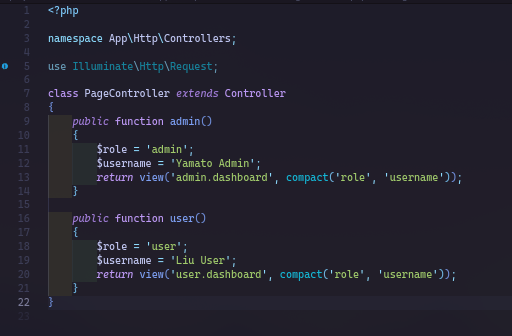

    4. Membuat layout dasar menggunakan Bootstrap di resources/views/layouts/app.blade.php: 
    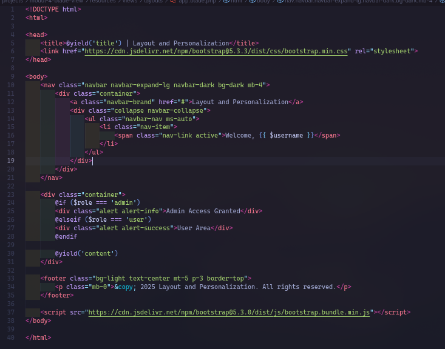

    5. Buat direktori admin didalam views/ untuk Admin di file baru resources/views/admin/app.blade.php: 
    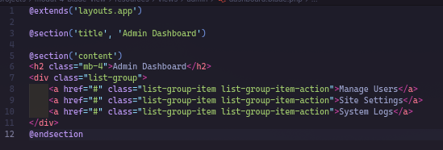

    6. Buat direktori user didalam views/ untuk User di file baru resources/views/user/dashboard.blade.php: 
    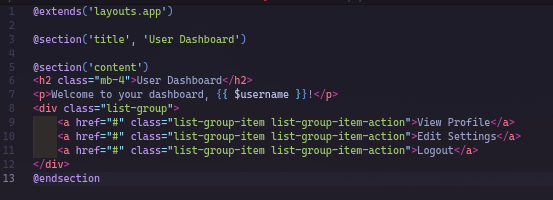

    7. Sudah selesai dan sudah dapat dijalankan menggunakan "php artisan serve"

### 2.4 Praktikum 4 - Partial Views, Blade Components, dan Theme Switching di Laravel 12
- Langkah-langkah:
    1. Buat dan masuk ke projek laravel, dengan mengetik: 
    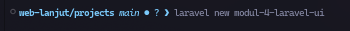
    Lalu masuk ke dalam folder projek nya 

    2. Buat controller UIController 
    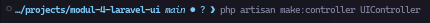

    3. Definisikan route di routes/web.php 
    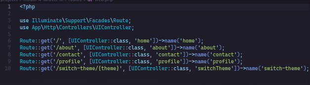

    4. Update kode didalam Controller UIController 
    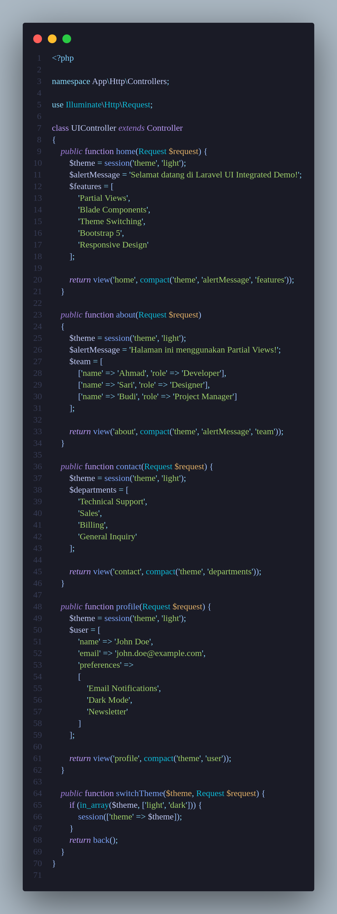

    5. Buat Layout utama dengan Theme Support di direktori layouts di resources/views/layouts/app.blade.php 
    

    6. Buat Partial Views di resources/views/partials/navigation.blade.php 
    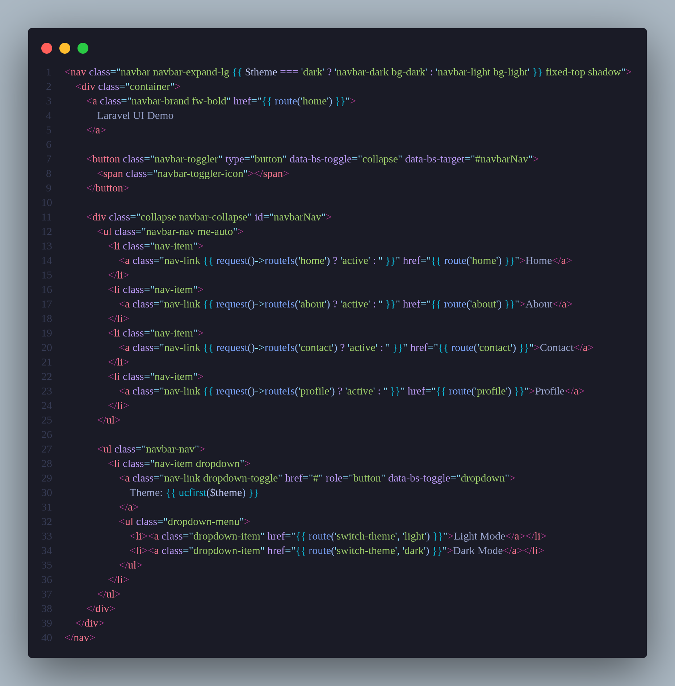

    7. buat file baru di resources/views/partials/alert.blade.php 
    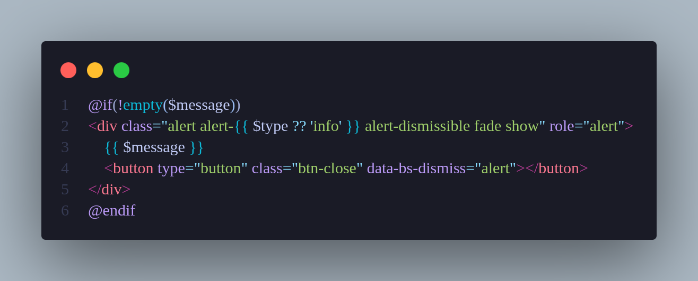

    8. Buat blade components 
    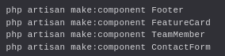
    Lalu edit: 

        1. resources/views/components/footer.blade.php 
        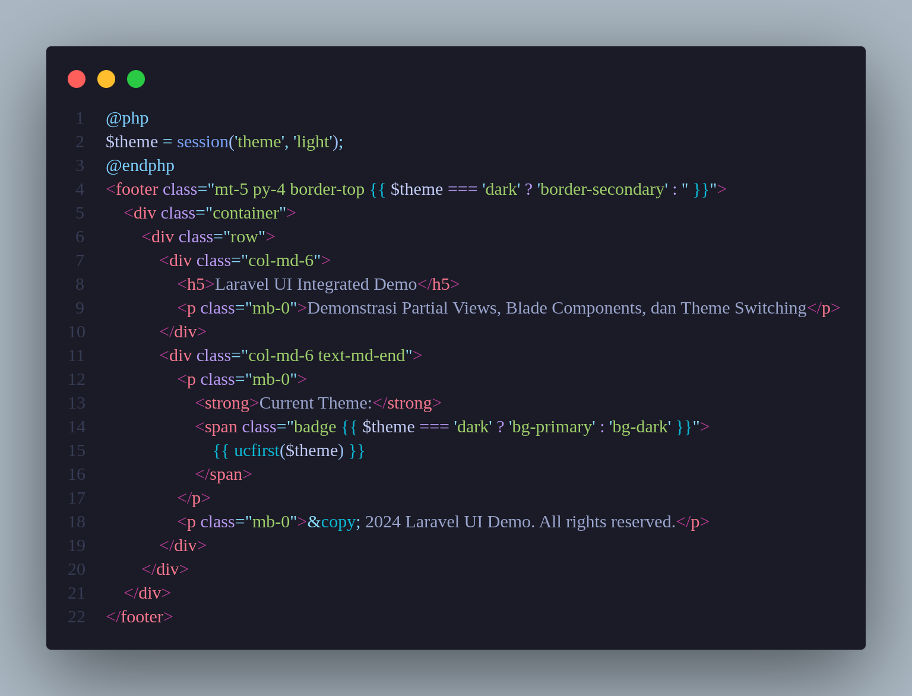
        
        2. resources/views/components/feature-card.blade.php 
        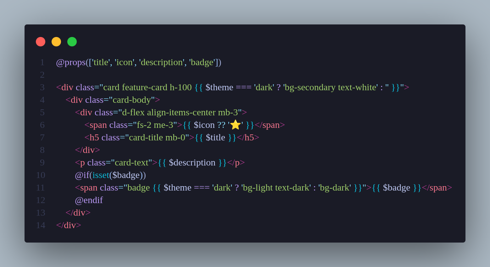

        3. resources/views/components/team-member.blade.php 
        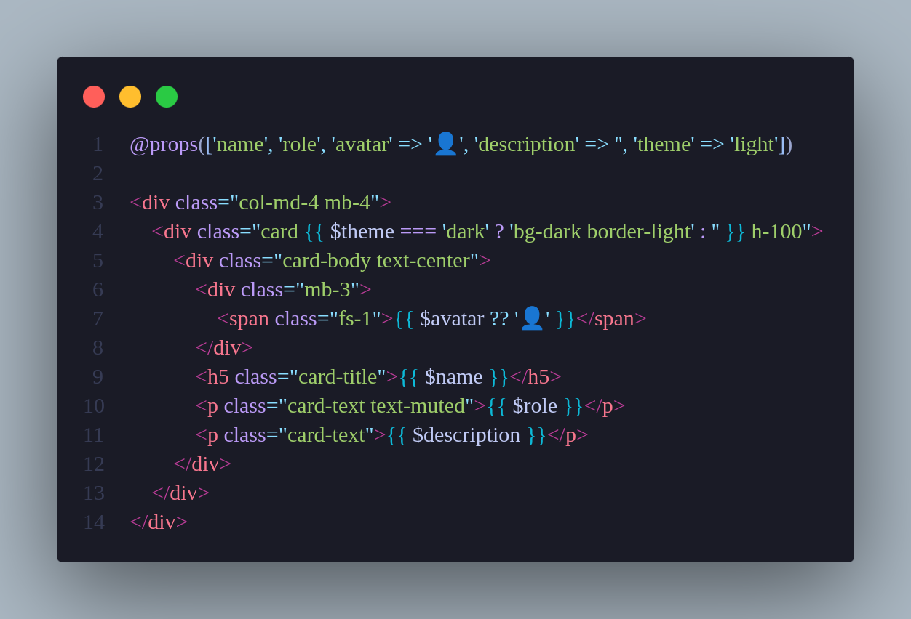
    
    9. Lalu buat views utama di resources/views/home.blade.php 
    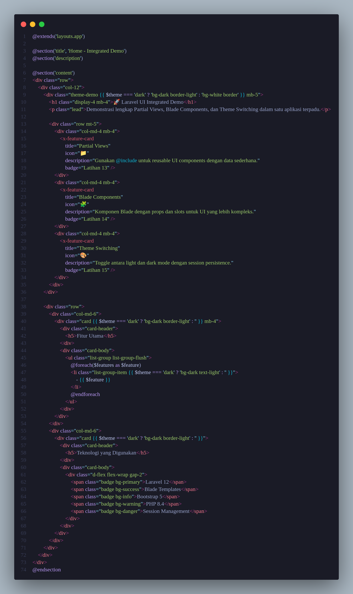

    10. Kemudian buat file resources/views/about.blade.php 
    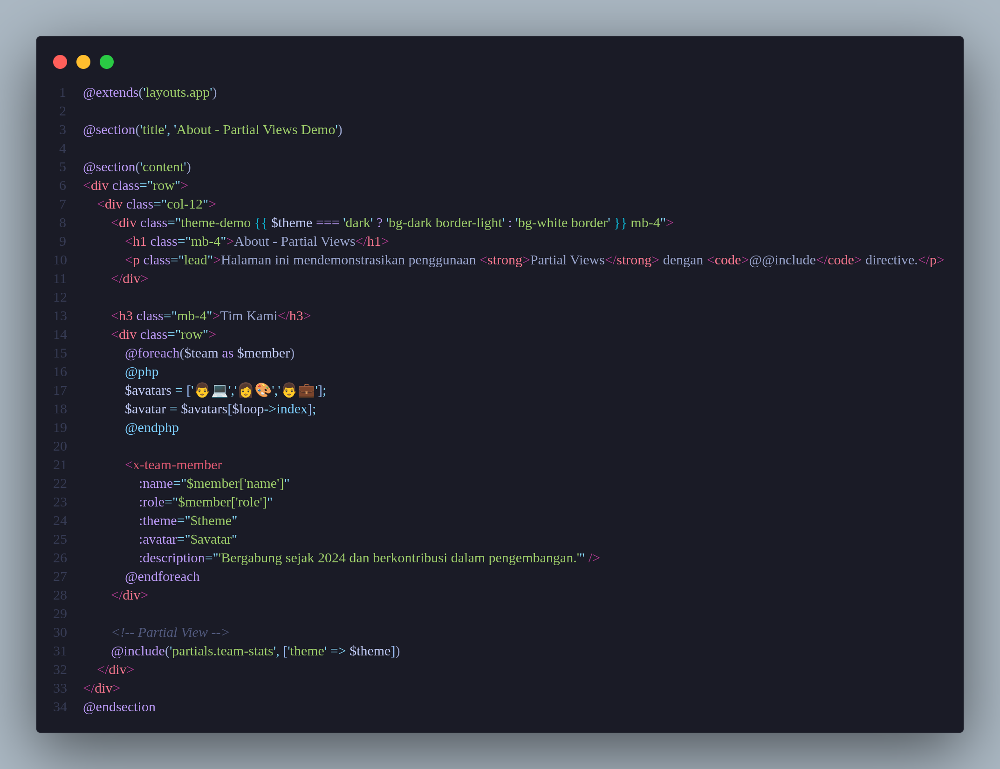

    11. Selanjutnya, resources/views/partials/team-stats.blade.php 
    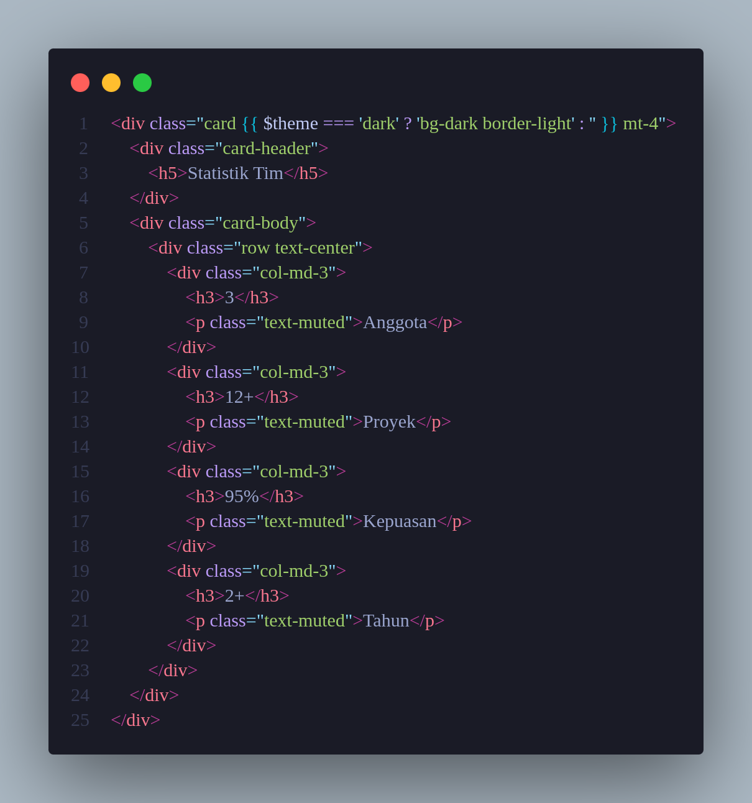

    12. Selanjutnya, resources/views/contact.blade.php 
    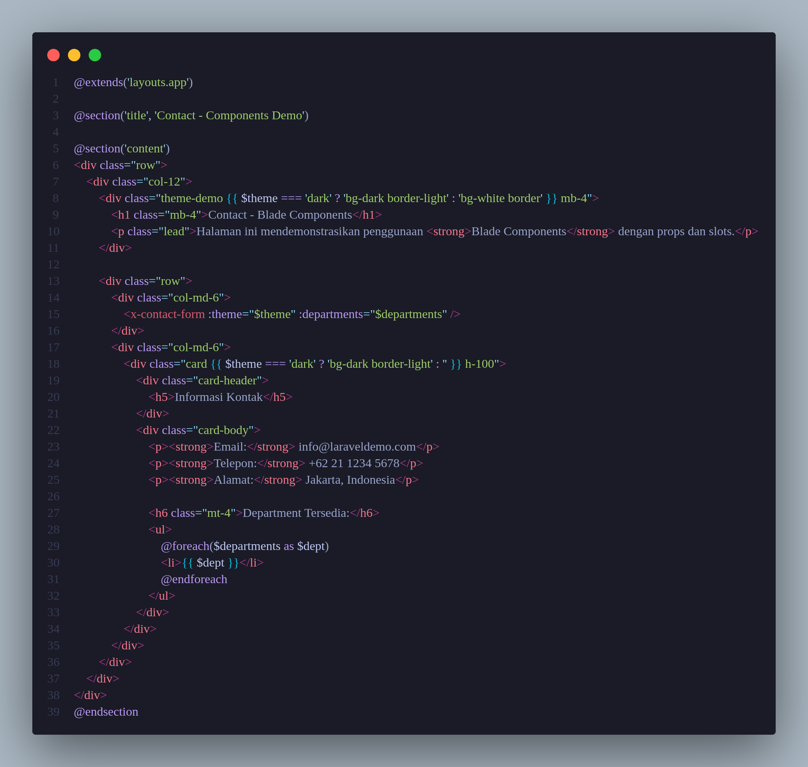

    13. Selanjutnya, resources/views/components/contact-form.blade.php 
    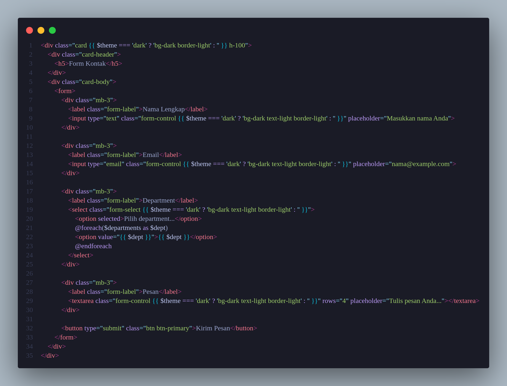

    14. Lalu, resources/views/profile.blade.php 
    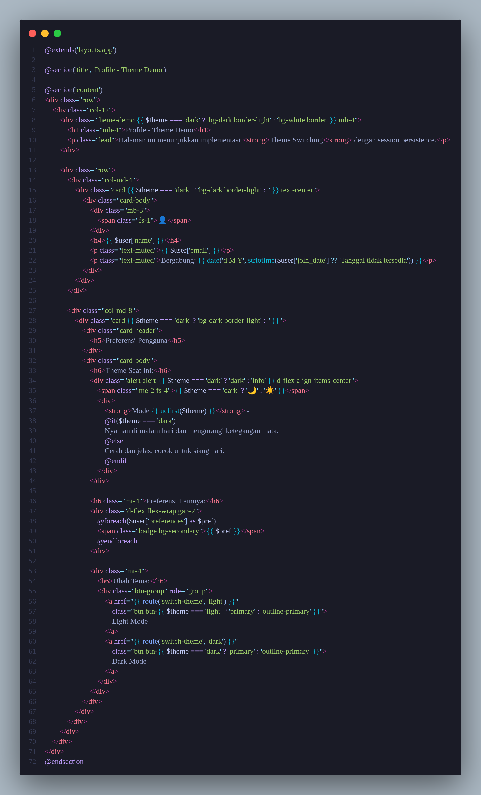

    15. Sudah selesai dan sudah dapat dijalankan menggunakan "php artisan serve".

---

## 3. Hasil dan Pembahasan
Dari hasil keempat praktikum, saya mendapatkan pemahaman yang lebih mendalam tentang bagaimana Blade bekerja di dalam framework Laravel.

Pada Praktikum 1, saya belajar bagaimana controller mengirimkan data ke view Blade. Proses ini penting karena data dari backend harus bisa tampil di halaman web. Contohnya, ketika kita ingin menampilkan nama user atau hasil query database, kita cukup meneruskannya dari controller lalu dipanggil di Blade menggunakan sintaks {{ $variable }}. Ini jauh lebih aman dan rapi dibandingkan mencampur langsung logika PHP di file HTML.

Di Praktikum 2, saya mempelajari struktur kontrol Blade, seperti @if, @foreach, dan @for. Sintaks ini memudahkan saya dalam membuat tampilan dinamis seperti menampilkan daftar data, kondisi login, atau pesan tertentu tanpa harus menulis banyak kode PHP. Blade sudah menyediakan cara yang lebih bersih untuk mengatur alur tampilan, dan ini membuat kode mudah dibaca oleh tim.

Kemudian pada Praktikum 3, saya mulai membuat layout dan personalisasi tampilan menggunakan Bootstrap. Di sini saya belajar membuat file layouts/app.blade.php sebagai template utama, lalu memanfaatkan @yield dan @section untuk menampilkan konten di tiap halaman berbeda seperti halaman admin dan user. Konsep ini membuat tampilan lebih konsisten karena semua halaman bisa menggunakan satu layout dasar yang sama — seperti kerangka utama website.

Terakhir di Praktikum 4, saya mempelajari konsep Partial Views, Blade Components, dan Theme Switching. Dengan Partial Views, saya bisa memisahkan bagian halaman seperti navbar, footer, atau alert ke file terpisah. Sedangkan dengan Components, saya dapat membuat komponen reusable seperti kartu fitur (feature-card) atau form kontak (contact-form). Selain itu, tema (theme switching) juga membuat tampilan bisa berganti gaya dengan mudah tanpa ubah banyak file. Praktikum ini menunjukkan bagaimana Laravel mempermudah pengembangan tampilan web modern dan modular.

Secara keseluruhan, saya jadi paham bahwa Blade bukan cuma sekadar “template HTML”, tapi sebuah sistem yang benar-benar membantu developer menjaga kerapian, keteraturan, dan fleksibilitas tampilan web di Laravel.

---

## 4. Kesimpulan
Dari seluruh rangkaian praktikum, dapat disimpulkan bahwa Blade Template Engine adalah salah satu fitur paling penting dalam Laravel untuk mengatur tampilan web secara efisien. Blade memisahkan logika program dan tampilan agar kode mudah dikelola, mudah dibaca, serta bisa digunakan ulang (reusable).

Saya juga belajar cara:
Mengirim data dari controller ke view dengan mudah, menggunakan struktur kontrol seperti @if, @foreach, dan @switch, membuat layout utama dan mewariskannya ke halaman lain menggunakan @extends, mengelola partial views dan components agar kode tampilan tidak berulang.

Dengan Blade, pembuatan tampilan web menjadi lebih cepat, profesional, dan siap untuk pengembangan aplikasi skala besar. Praktikum ini memperkuat pemahaman saya terhadap arsitektur MVC di Laravel, khususnya di sisi View yang dikelola dengan sangat rapi oleh Blade.

---

## 5. Referensi
- Apa itu Laravel? - https://www.rumahweb.com/journal/belajar-laravel-bagian-4/#Apa_itu_Blade_Templating
- Fitur Utama Laravel Templating - https://hackmd.io/@mohdrzu/r1AIUzWpll#Praktikum

---