# Laporan Modul 5: Form Validation & Data Submission
**Mata Kuliah:** Workshop Web Lanjut   
**Nama:** Hamizan Putra Zulia
**NIM:** 2024573010013
**Kelas:** TI-2C

---

## Abstrak 
Laporan praktikum ini membahas tentang bagaimana cara melakukan validasi form dan pengiriman data (data submission) di Laravel 12. Praktikum ini dilakukan untuk memahami bagaimana sistem Laravel menangani input dari pengguna, memvalidasi data sebelum disimpan, dan mengamankan proses pengiriman data menggunakan CSRF protection. Selain itu, juga dipelajari tentang pembuatan form multi-step menggunakan session agar pengguna dapat mengisi data secara bertahap. Tujuan dari laporan ini adalah untuk mengetahui dan mempraktikkan cara membuat form yang aman, rapi, dan valid di Laravel sesuai dengan standar framework modern.

---

## 1. Dasar Teori

Method - method form yang ada di dalam Laravel:
- POST: Mengirim data baru
- PUT/PATCH: Mengupdate data yang sudah ada
- DELETE: Menghapus data  

Apa itu csrf protection? 
CSRF (Cross-Site Request Forgery) adalah serangan yang mengelabui pengguna agar mengirimkan permintaan berbahaya. Serangan ini memanfaatkan fakta bahwa peramban secara otomatis menyertakan kredensial (seperti kuki) pada setiap permintaan, sehingga memungkinkan penyerang melakukan tindakan atas nama pengguna tanpa persetujuan mereka.  

Apa itu Data Validation? 
Validasi data berarti memeriksa keakuratan dan kualitas data sumber sebelum menggunakan, mengimpor, atau memproses data dengan cara lain. Berbagai jenis validasi dapat dilakukan tergantung pada batasan atau tujuan tujuan. Validasi data merupakan salah satu bentuk pembersihan data.  
    Jenis-jenis:
        1. Controller Validation (Inline Validation)
        2. Form Request Validation
        3. Manual Validation
  

Kategori Validation Rules
Basic Rules

    required: Field wajib diisi
    nullable: Field boleh kosong
    filled: Jika ada, harus berisi nilai
    sometimes: Validasi hanya jika field ada

Type Validation

    string: Harus string
    numeric: Harus angka
    integer: Harus integer
    boolean: Harus boolean
    array: Harus array
    file: Harus file upload

Size Validation

    min:value: Minimum size (string length, numeric value, file size)
    max:value: Maximum size
    size:value: Exact size
    between:min,max: Rentang nilai

Database Rules

    unique:table,column: Nilai harus unik di database
    exists:table,column: Nilai harus ada di database

Format Validation

    email: Format email valid
    url: Format URL valid
    ip: IP address valid
    date: Format tanggal valid
    regex:pattern: Cocok dengan regex pattern

Comparison Rules

    confirmed: Field harus memiliki field _confirmation
    same:field: Harus sama dengan field lain
    different:field: Harus berbeda dari field lain

## 2. Langkah-Langkah Praktikum

### 2.1 Praktikum 1 - Menangani Request dan Response View di Laravel 12

- Langkah-langkah:
    1. Buat dan masuk ke projek laravel
     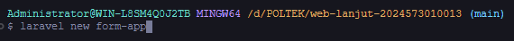

    2. Masuk ke routes/web.php dan isi seperti:
     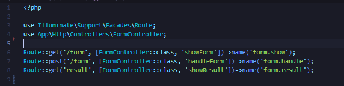

    3. Lalu buat controller FormController dengan perintah:
     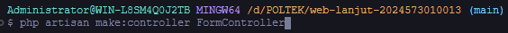

    4. Masuk ke file Controller yg telah dibuat dan isi kode seperti contoh:
     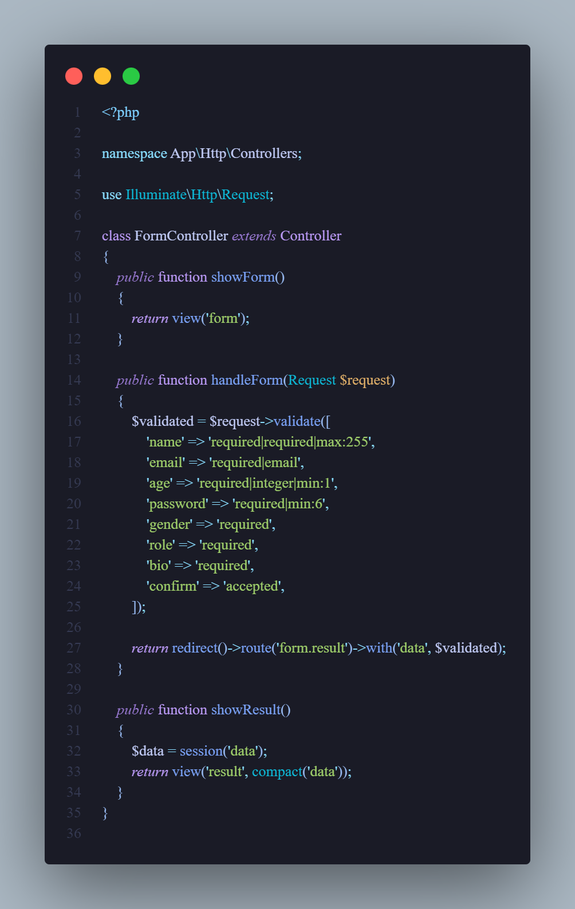

    5. Membuat file view baru dengan nama form.blade.php di resources/views dan isi seperti contoh:
     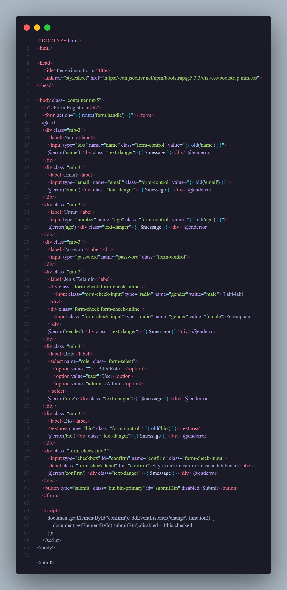

    6. Membuat file hasil bernama result.blade.php di resources/views dengan isi seperti:
     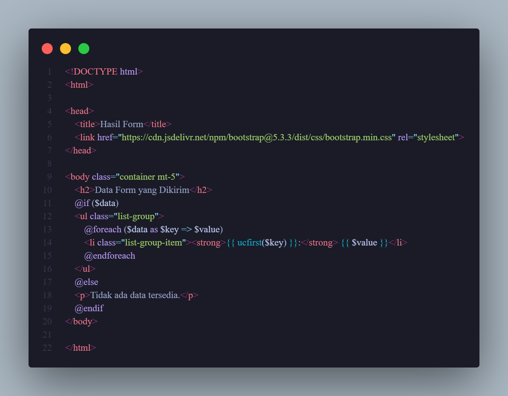

    7. Sudah selesai dan sudah dapat dijalankan menggunakan "php artisan serve"

### 2.2 Praktikum 1 - Validasi Kustom dan Pesan Error di Laravel 12

- Langkah-langkah:
    1. Masuk ke projek yang sudah dibuat dalam praktikum sebelumnya, kemudian tambahkan route baru seperti:
     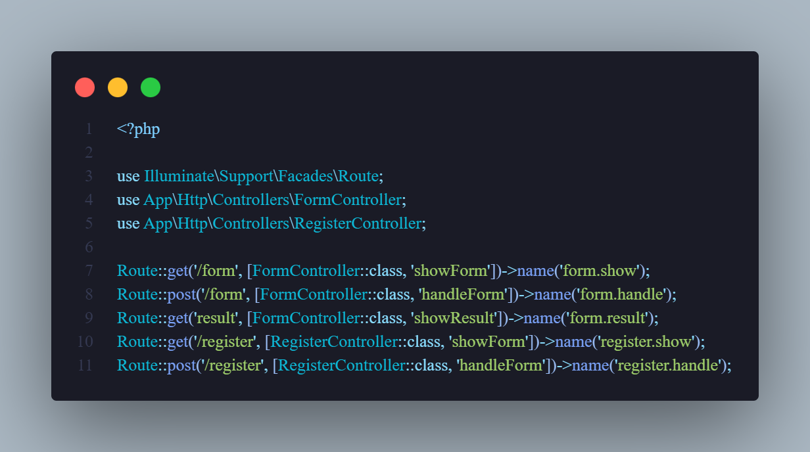

    2. Lalu buat controller RegisterController dengan cara:
     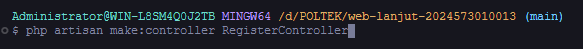

    3. Masuk ke file RegisterController.php isi kode seperti berikut:
     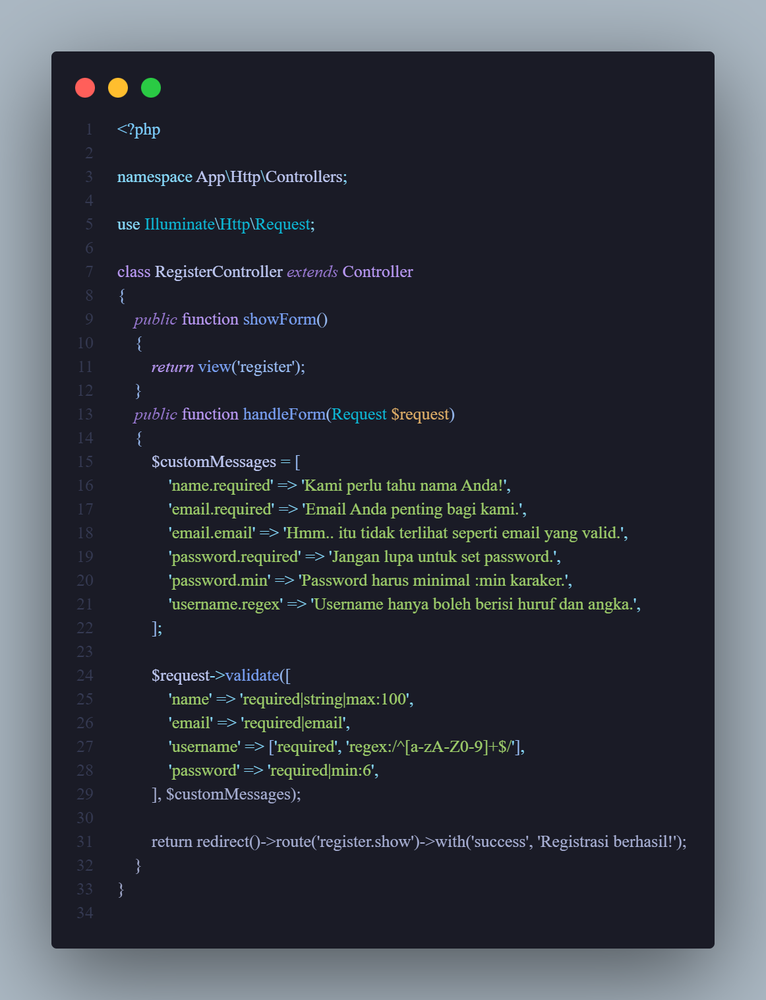

    4. Buat file view baru dalam resources/views dengan nama register.blade.php, dan isikan kode berikut:
     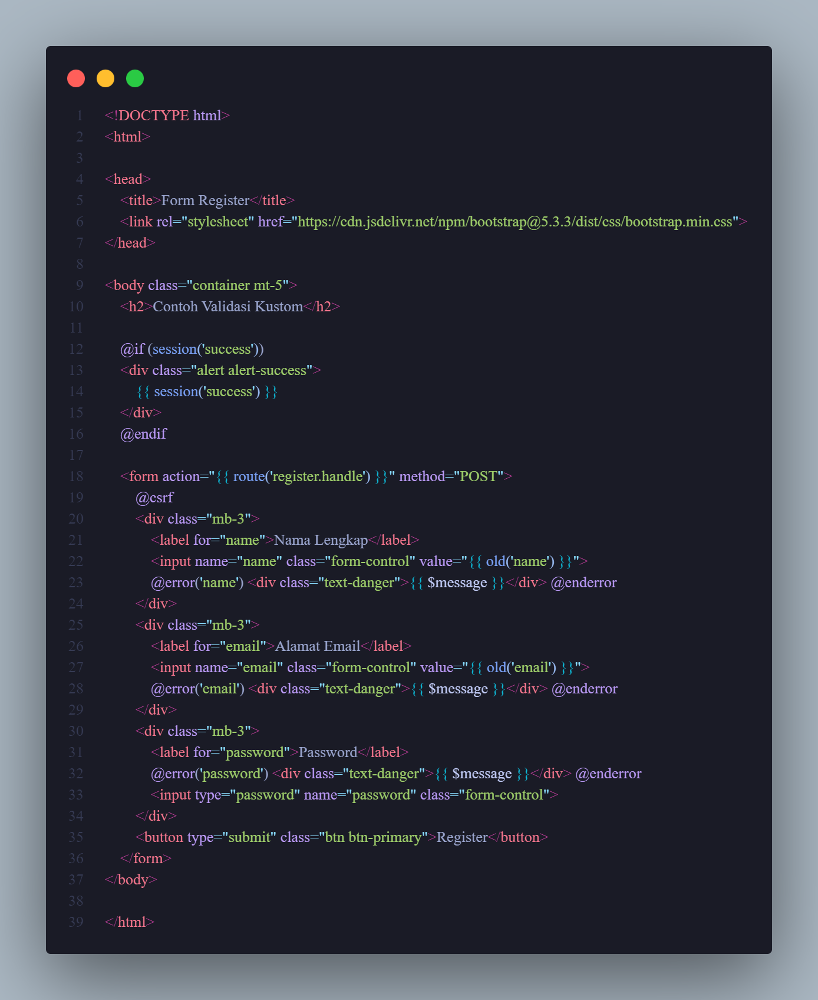

    5. Dan sudah bisa menjalankan http://localhost:8000/register untuk tes form

### Praktikum 2.3 - Multi-Step Form Submission dengan Session Data

- Langkah-langkah:
    1. Buat projek baru dan masuk ke dalam projek
     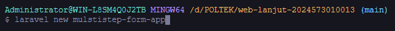
    
    2. Buat layout dasar dalam folder resources/views/app.blade.php dan isikan kode berikut:
     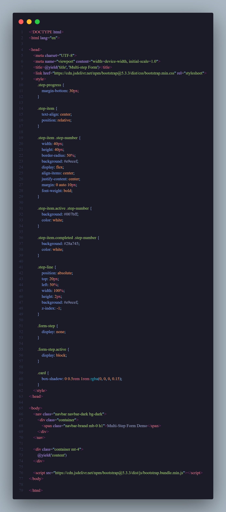

    3. Masuk ke routes/web.php dan isika kode berikut:
     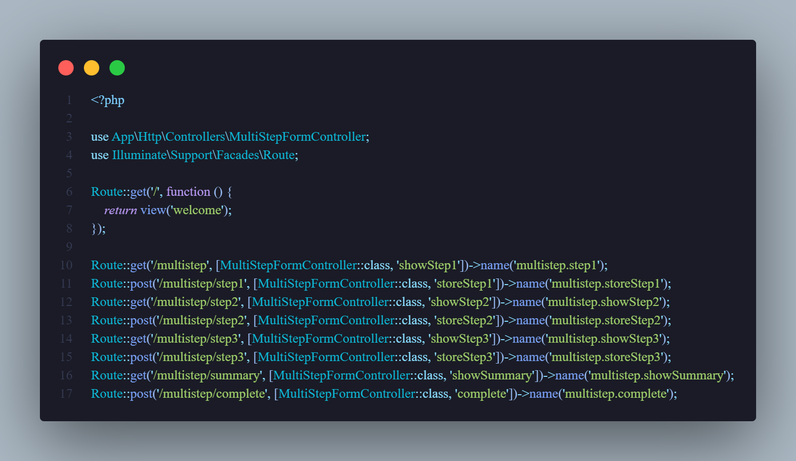

    4. Buat controller baru dengan nama MultiStepController
     

    5. Masuk ke dalam file MultiStepController.php dan isikan kode berikut:
     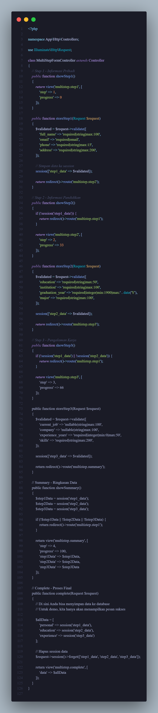

    6. Buat folder baru dengan nama multistep dalam resources/views/ dan buat:
        - resources/views/multistep/step1.blade.php
         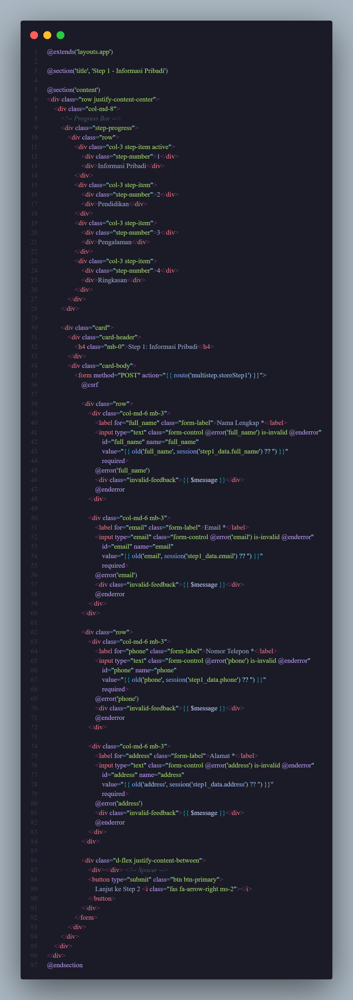

        - resources/views/multistep/step2.blade.php
         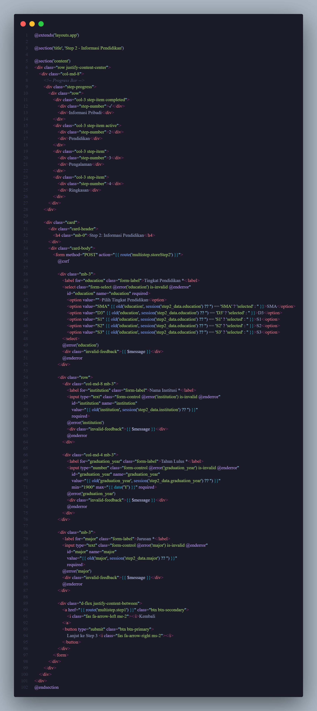

        - resources/views/multistep/step3.blade.php
         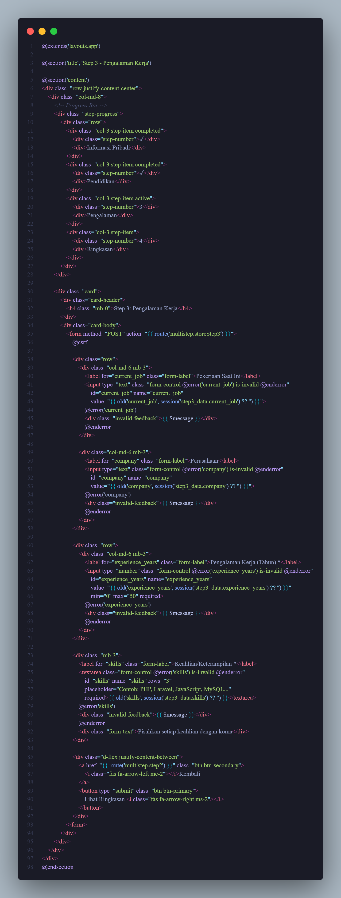

        - resources/views/multistep/summary.blade.php
         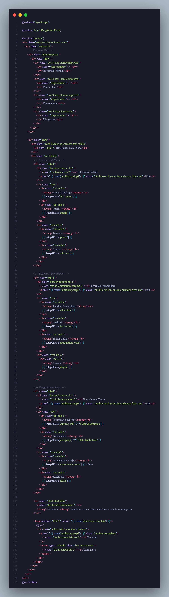

        - resources/views/multistep/complete.blade.php
         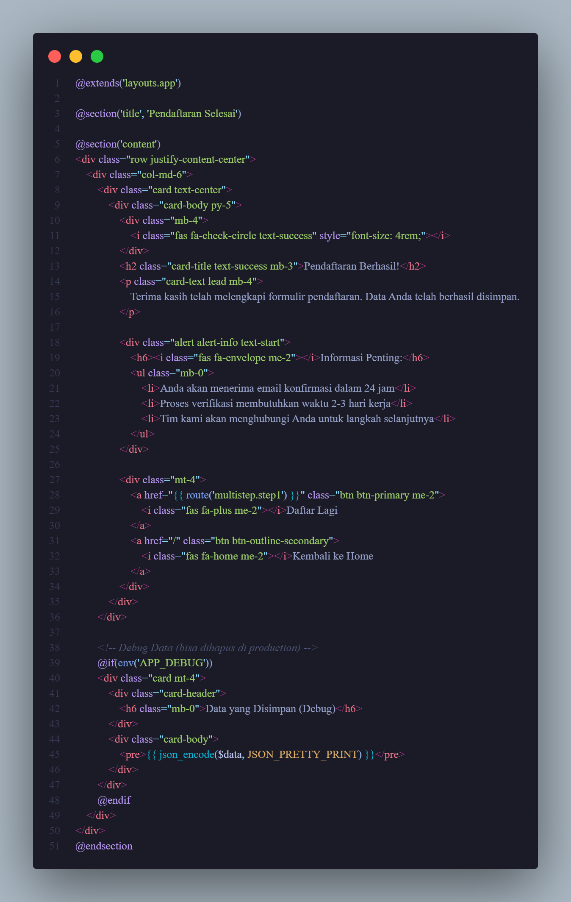

---

## 3. Hasil dan Pembahasan
Pada praktikum ini dilakukan beberapa percobaan untuk memahami cara Laravel menangani form, validasi, serta pengiriman data dari user ke server.

1. Menangani Request dan Response View di Laravel 12

Pada bagian ini dilakukan pembuatan form sederhana yang dikirim melalui route menggunakan method POST. Data dari form kemudian diterima oleh controller dan dikirim kembali ke halaman hasil (result.blade.php). Dari sini dipahami bahwa Laravel menggunakan sistem route, controller, dan view untuk mengatur alur data dari pengguna sampai ke tampilan akhir.

2. Validasi Kustom dan Pesan Error

Langkah ini menunjukkan bagaimana Laravel memvalidasi input dengan berbagai rule seperti required, email, dan min. Selain itu juga dibuat pesan error kustom agar lebih mudah dipahami pengguna. Saat input tidak sesuai aturan, Laravel akan otomatis mengembalikan pesan error tanpa harus membuat logika manual. Hal ini memperlihatkan betapa mudahnya Laravel dalam menangani validasi form hanya dengan beberapa baris kode.

3. Multi-Step Form Submission

Praktikum ini adalah bagian yang paling menarik karena melibatkan form yang diisi secara bertahap. Setiap langkah menyimpan data sementara ke session sebelum akhirnya semua data dikumpulkan dan ditampilkan di halaman summary. Sistem ini memperlihatkan bagaimana Laravel memanfaatkan session untuk menyimpan data pengguna sementara tanpa perlu database terlebih dahulu. Proses ini juga memperlihatkan struktur controller dan view yang terorganisir untuk setiap langkah form.

Secara keseluruhan, hasil dari praktikum menunjukkan bahwa Laravel memberikan kemudahan besar dalam membuat sistem form yang aman, terstruktur, dan fleksibel. Dengan fitur validasi otomatis dan CSRF protection bawaan, keamanan dan keakuratan data pengguna dapat lebih terjamin.

---

## 4. Kesimpulan
Dari hasil praktikum ini dapat disimpulkan bahwa Laravel memiliki sistem yang kuat dan efisien untuk menangani form input, validasi, dan pengiriman data. Validasi di Laravel dapat dilakukan dengan mudah melalui berbagai cara seperti controller validation dan form request validation, serta mendukung pesan error kustom yang membantu pengguna memahami kesalahan input.
Selain itu, penggunaan CSRF protection sangat penting untuk mencegah serangan berbahaya yang bisa mengirimkan data tanpa izin pengguna.
Melalui multi-step form, dipelajari juga bagaimana Laravel bisa menyimpan data sementara dengan session agar pengguna dapat mengisi data secara bertahap.
Secara keseluruhan, praktikum ini memperdalam pemahaman tentang bagaimana membuat sistem form yang aman, nyaman, dan profesional dengan menggunakan framework Laravel 12.

---

## 5. Referensi
- CSRF Protectoin - https://www-inmotionhosting-com.translate.goog/support/edu/laravel/csrf-protection/?_x_tr_sl=en&_x_tr_tl=id&_x_tr_hl=id&_x_tr_pto=tc
- Data Validation - https://www-informatica-com.translate.goog/services-and-training/glossary-of-terms/data-validation-definition.html?_x_tr_sl=en&_x_tr_tl=id&_x_tr_hl=id&_x_tr_pto=tc
- https://hackmd.io/@mohdrzu/HJWzYp7Reg#Praktikum

---