# Laporan Modul 6: Model dan Laravel Eloquent
**Mata Kuliah:** Workshop Web Lanjut   
**Nama:** Hamizan Putra Zulia
**NIM:** 2024573010013
**Kelas:** TI-2C

---

## Abstrak 
Laporan praktikum ini membahas tentang penerapan Model dan Laravel Eloquent ORM dalam pembuatan aplikasi berbasis web menggunakan framework Laravel 12. Tujuan dari praktikum ini adalah untuk memahami bagaimana cara menghubungkan aplikasi dengan database menggunakan model, bagaimana Eloquent ORM bekerja dalam menangani proses CRUD (Create, Read, Update, Delete), dan bagaimana penggunaan DTO (Data Transfer Object) dapat membantu menjaga struktur kode agar tetap bersih dan mudah dikembangkan.
Selain itu, laporan ini juga mencakup implementasi aplikasi sederhana seperti Todo App yang menggunakan database MySQL dengan konsep Eloquent ORM. Dengan adanya praktikum ini, diharapkan mahasiswa mampu memahami cara kerja model di Laravel serta dapat membangun aplikasi yang efisien, terstruktur, dan mudah dipelihara.

---

## 1. Dasar Teori
Pengertian MVC (Model, View, Controller) 

MVC adalah sebuah pendekatan perangkat lunak yang memisahkan aplikasi logika dari presentasi. MVC memisahkan aplikasi berdasarkan komponen- komponen aplikasi, seperti : manipulasi data, controller, dan user interface.

    Model, Model mewakili struktur data. Biasanya model berisi fungsi-fungsi yang membantu seseorang dalam pengelolaan basis data seperti memasukkan data ke basis data, pembaruan data dan lain-lain.
    View, View adalah bagian yang mengatur tampilan ke pengguna. Bisa dikatakan berupa halaman web.
    Controller, Controller merupakan bagian yang menjembatani model dan view.

Contoh MVC pada Laravel

Pertama, kita buat controller dengan perintah artisan dengan nama controller BelajarController.

Menggunakan Data Transfer Objects (DTO) di Laravel untuk Arsitektur yang Bersih dan Skalabel

    Dalam aplikasi Laravel, penting untuk menjaga kode tetap mudah dibaca, mudah dipelihara, dan skalabel. Salah satu pendekatan yang dapat Anda lakukan untuk meningkatkan struktur kode adalah dengan menggunakan Objek Transfer Data (DTO). Teknik ini membantu memisahkan masalah dengan menciptakan objek yang hanya membawa data antar lapisan aplikasi yang berbeda.

    Mengapa Menggunakan DTO?

DTO menawarkan beberapa keuntungan:

    Pemisahan Permasalahan : Membantu menjaga agar berbagai lapisan aplikasi Anda terpisah dengan baik.
    Kejelasan Kode : Dengan mengirimkan objek sederhana yang hanya berisi data, Anda meningkatkan keterbacaan dan pemeliharaan kode Anda.
    Skalabilitas : DTO membuat kode Anda lebih mudah diuji dan diperluas tanpa menduplikasi logika.

Apa itu EWloquent ORM?
    Eloquent ORM adalah fitur dari Laravel yang memungkinkan developer untuk dapat menggunakan dan memanipulasi data yang ada di dalam database dengan PHP objects dan model terkait. 

    Sebagai Object-Relational Mapping (ORM) yang disediakan oleh Framework Laravel, Eloquent memiliki fungsi query SQL yang memungkinkan untuk mengelola data dalam database tanpa harus menuliskannya kembali secara manual. 

    ORM sendiri mengacu pada suatu metode pemrograman yang menghubungkan database relasional dengan kode pemrograman yang berorientasi sebagai objek. 

    Hal ini memungkinkan interaksi antara database dan objek menjadi mudah, sehingga developer dapat memanfaatkan kode saat bekerja alih-alih menulis SQL secara manual. 

    Model atau kode pemrograman yang berbentuk objek tersebut kemudian dipergunakan untuk melakukan operasi data seperti CRUD (Create, Read, Update, Delete) secara efisien dan mudah dalam database. 

## 2. Langkah-Langkah Praktikum

### 2.1 Praktikum 1 - Menggunakan Model untuk Binding Form dan Display

- Langkah-langkah: 
    1. Buat projek baru dan masuk kedalamnya
     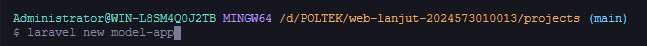

    2. Buat model data sederhana (POCO)
     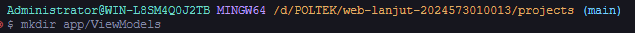

    3. Masuk ke direktori app\ViewModels dan isi:
     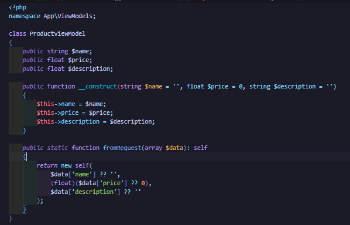

    4. Buat controller productController
     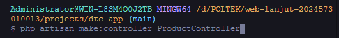

    5. Edit file ProductController.php dengan mengisi:
     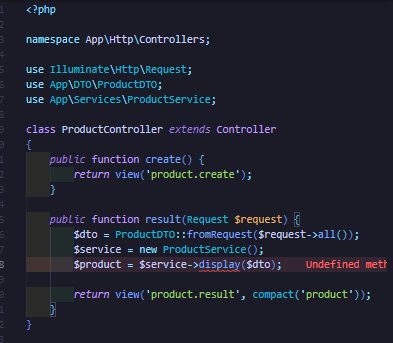

    6. Definisikan route/web.php:
     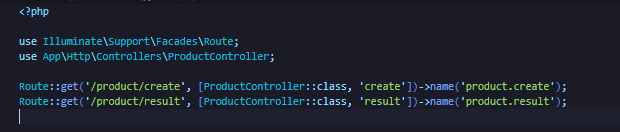

    7. Buat direktori resources/views/product

    8. Buat dua file bernama create.blade.php dan result.blade.php dan isikan
        create.blade.php :
         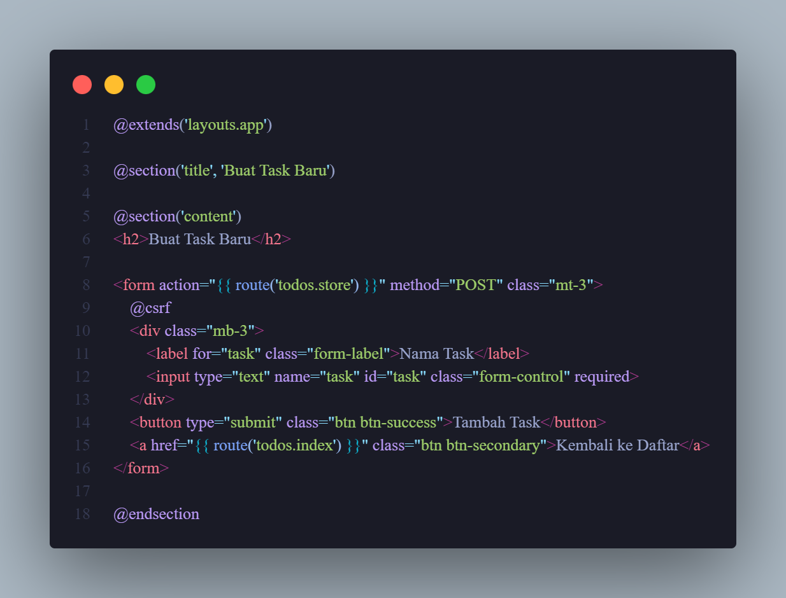
     
        result.blade.php
         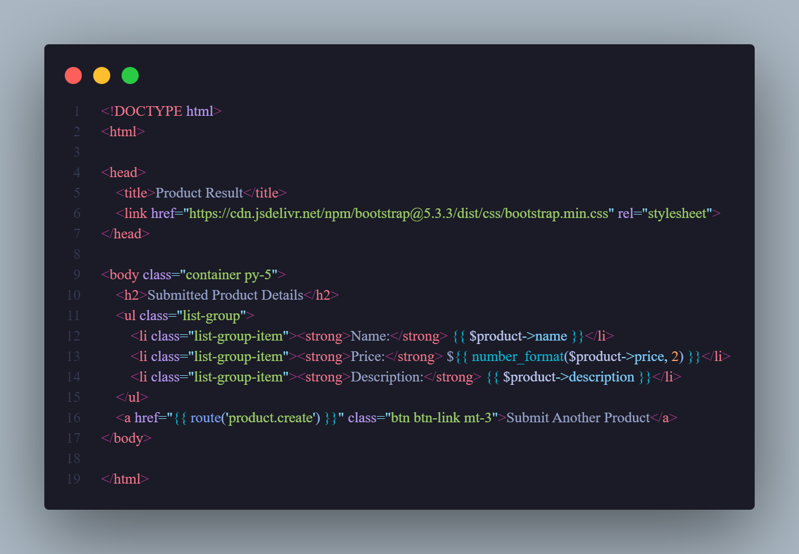

    9. Dan web sudah selesai, sudah bisa dijalankan menggunakan 'php artisan serve'

### 2.2 Praktikum 2 - Menggunakan DTO (Data Transfer Object)

- Langkah-langkah: 
    1. Buat projek baru dan masuk ke dalam projek nya
     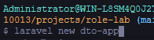

    2. Buat direktori baru 

    3. Buat dan masuk ke file app/DTO/ProductDTO.php dan isi:
     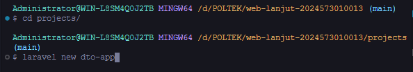

    4. Lalu buat folder baru app/Services/ProductServices.php dan isikan:
     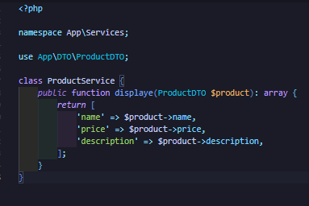

    5. buat controller baru dengan nama ProductController
     

    6. Masuk dan edit file ProductController.php
     

    7. Edit file routes/web.php
     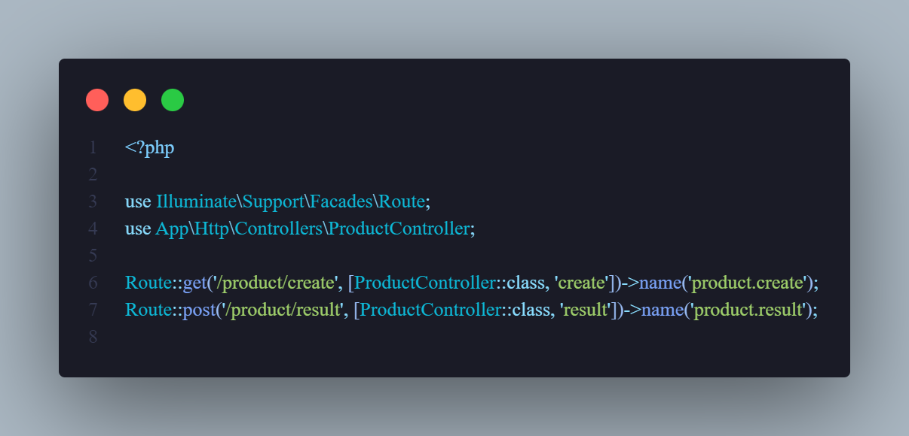

    8. Buat direktori product dalam resources/views

    9. Buat 2 file view dalam folder product 
        - create.blade.php
         

        - result.blade.php
         

    10. Sudah selesai, dan jalankan web menggunakan 'php artisan serve'

### 2.3 Praktikum 3 - Membangun Aplikasi Web Todo Sederhana dengan Laravel 12, Eloquent ORM, dan MySQL

- Langkah-langkah: 
    1. Buat projek baru dan masuk ke dalam projek nya
     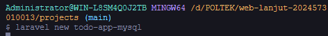
    
    2. Install dependensi MySQL
     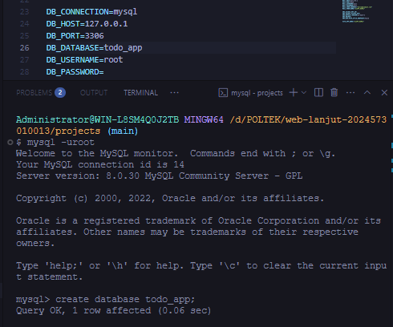
    
    3. Konfigurasi bagian .env
     

    4. Buat migration todos
     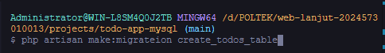

    5. isi file create_todos_tables yang baru dibuat dengan
     

    6. Jalankan 'php artisan migrate'

    7. Jalankan perintah untuk membuat seeder dengan cara:
     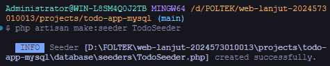

    8. Dalam file seeder yg baru dibuat isikan:
     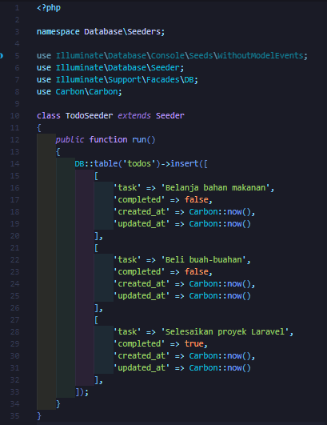

    9. Jalankan perintah 'php artisan db:seed --class=TodoSeeer'

    10. Buat model bernama Todo
     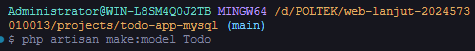

    11. Isikan file yang baru ditambahkan dengan:
     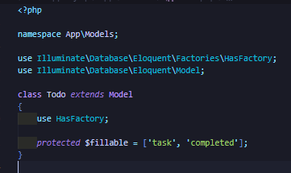

    12. Jalankan perintah untuk membaut TodoController:
     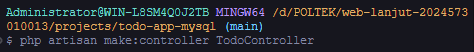

    13. Isi kode ini untuk file TodoController.php:
     

    14. Masuk dan edit routes/web.php dengan:
     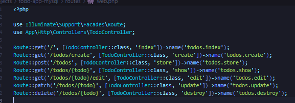

    15. Buat foler layouts di resources/views dan buat file app.blade.php lalu isikan:
     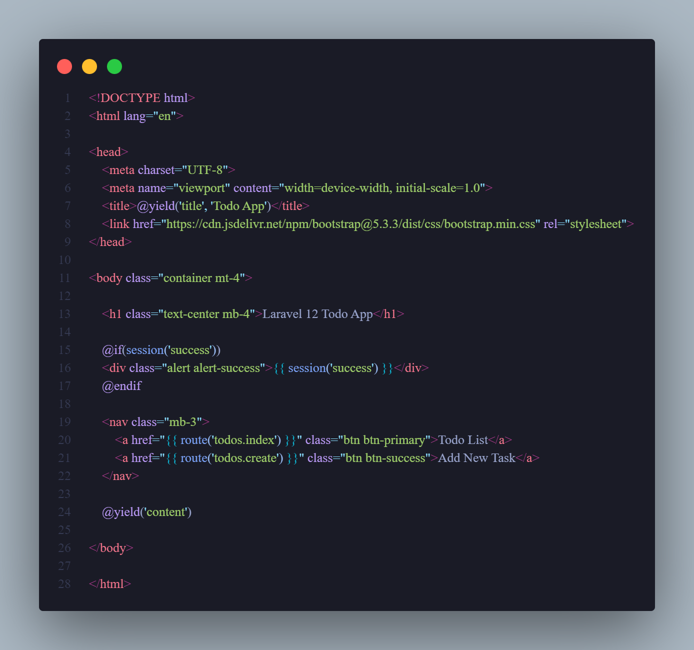

    16. Buat file didalam resources/views/todos/index.blade.php dan isikan
     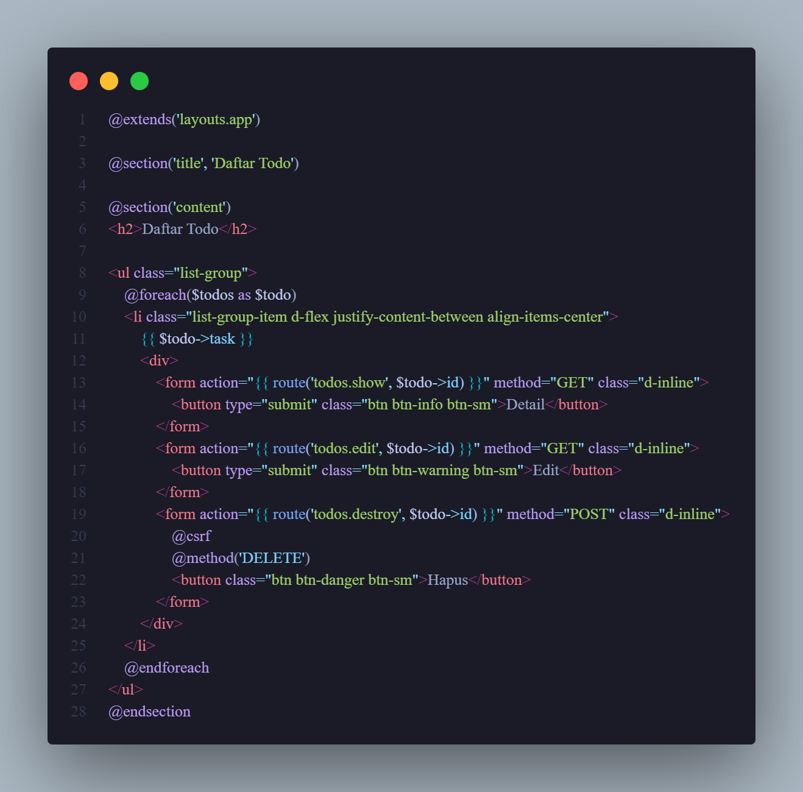

    17. Buat file didalam resources/views/todos/create.blade.php dan isikan
     

    18. Buat file didalam resources/views/todos/edit.blade.php dan isikan
     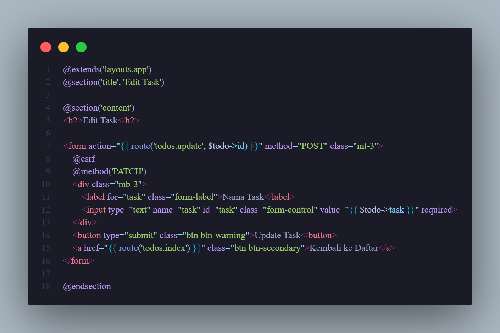

    19. Buat file didalam resources/views/todos/show.blade.php dan isikan
     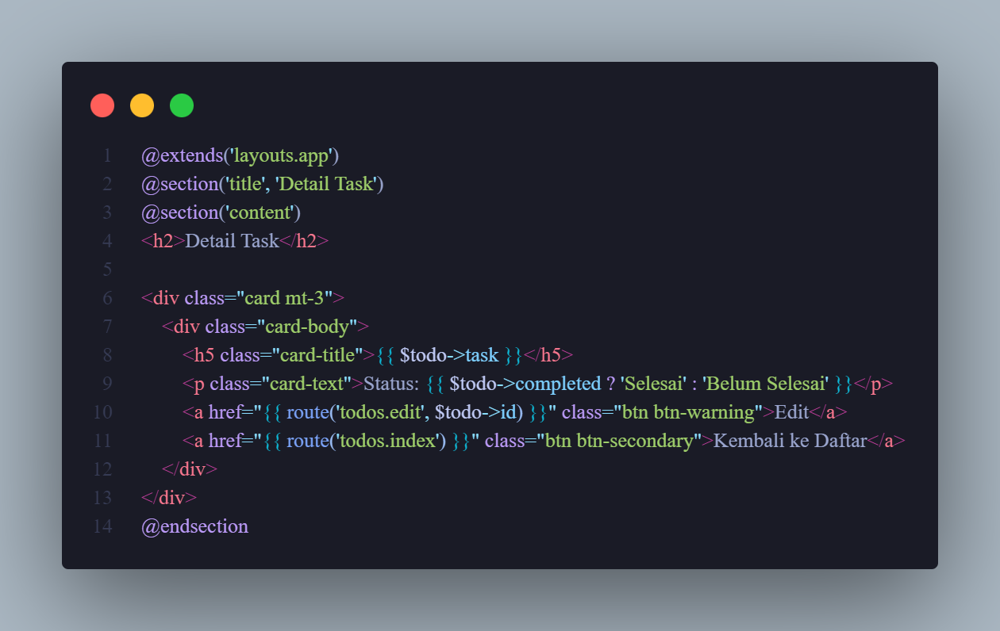

    20. Dan Web app sudah selesai, sudah bisa jalankan 'php artisan serve' 

---

## 3. Hasil dan Pembahasan
1. Praktikum 1 – Menggunakan Model untuk Binding Form dan Display

Pada praktikum pertama, dibuat sebuah model sederhana untuk menampilkan dan menerima data dari form. Model ini berfungsi sebagai penghubung antara form input pengguna dan tampilan hasil (view).
Controller bertugas menerima input dari form, lalu mengirimkannya ke view menggunakan model yang telah dibuat. Proses ini menunjukkan bagaimana model di Laravel dapat digunakan untuk mengatur dan mengelola data secara efisien tanpa harus terhubung langsung ke database.
Dari hasil percobaan, data yang dikirim melalui form berhasil ditampilkan kembali di halaman hasil, yang berarti komunikasi antara controller, model, dan view berjalan dengan baik.

2. Praktikum 2 – Menggunakan DTO (Data Transfer Object)

Pada bagian ini, dilakukan implementasi DTO (Data Transfer Object) untuk memisahkan logika bisnis dari logika data. DTO membantu agar data yang dikirim antar bagian aplikasi tetap rapi dan tidak bercampur dengan kode logika lainnya.
Data yang dikirim melalui form disimpan di dalam objek DTO, lalu diteruskan ke service untuk diproses lebih lanjut. Pendekatan ini membuat kode lebih mudah dibaca, lebih aman dari kesalahan manipulasi data, serta lebih mudah di-maintain dan dikembangkan di masa depan.
Dari hasil praktikum, data dari DTO berhasil ditampilkan dan diproses di controller, membuktikan bahwa DTO berfungsi dengan baik sebagai perantara data antar lapisan aplikasi.

3. Praktikum 3 – Membangun Aplikasi Web Todo Sederhana dengan Laravel 12, Eloquent ORM, dan MySQL

Praktikum ini merupakan penerapan langsung konsep Eloquent ORM. Dibuat aplikasi Todo List yang dapat melakukan operasi CRUD (Create, Read, Update, Delete) menggunakan database MySQL.
Langkah pertama adalah membuat migrasi dan model Todo, kemudian membuat controller yang menangani logika untuk menampilkan, menambah, mengedit, dan menghapus data todo.
Setelah itu dibuat beberapa file tampilan seperti index.blade.php, create.blade.php, edit.blade.php, dan show.blade.php. Semua file ini saling terhubung melalui route dan controller, yang mengatur bagaimana data dari database ditampilkan dan diolah.
Hasil dari percobaan menunjukkan bahwa semua fitur CRUD bekerja dengan baik — data yang disimpan bisa muncul di daftar todo, dapat diedit dan dihapus dengan lancar.
Dengan menggunakan Eloquent ORM, proses interaksi dengan database menjadi lebih sederhana dan ringkas, tanpa perlu menulis query SQL secara manual.

Secara keseluruhan, hasil dari ketiga praktikum ini menunjukkan bahwa Laravel Eloquent ORM sangat memudahkan pengelolaan data, dan DTO membantu menjaga struktur kode tetap rapi dan mudah dikembangkan.

---

## 4. Kesimpulan
Dari hasil praktikum Modul 6 ini dapat disimpulkan bahwa:

Model di Laravel berfungsi sebagai penghubung antara aplikasi dan database, serta menjadi tempat utama dalam mengatur logika data.

Eloquent ORM mempermudah proses interaksi dengan database karena memungkinkan developer untuk melakukan operasi CRUD menggunakan kode PHP berorientasi objek tanpa menulis SQL secara langsung.

DTO (Data Transfer Object) sangat berguna untuk menjaga agar kode tetap terstruktur, bersih, dan mudah dikembangkan dengan memisahkan data dari logika bisnis.

Penerapan Eloquent dan DTO menjadikan aplikasi lebih efisien, aman, serta mudah untuk di-maintain.

Melalui pembuatan aplikasi Todo List sederhana, dapat dibuktikan bahwa Eloquent ORM bekerja dengan sangat baik dalam mengelola data dari database MySQL secara otomatis dan efisien.

Secara keseluruhan, modul ini memberikan pemahaman yang lebih dalam tentang bagaimana Laravel mengelola data menggunakan model dan ORM, serta pentingnya struktur kode yang baik melalui penerapan DTO dalam pengembangan aplikasi modern.

---

## 5. Referensi
- Pengertian MVC - https://medium.com/@kevinnfa0107/pengertian-mvc-model-view-controller-pada-framework-laravel-20f261ccf233
- Laravel DTO - https://dev-to.translate.goog/blamsa0mine/using-data-transfer-objects-dto-in-laravel-for-a-clean-and-scalable-architecture-172o?_x_tr_sl=en&_x_tr_tl=id&_x_tr_hl=id&_x_tr_pto=tc
- Eloquent ORM - https://www.sekawanmedia.co.id/blog/eloquent-orm/

---